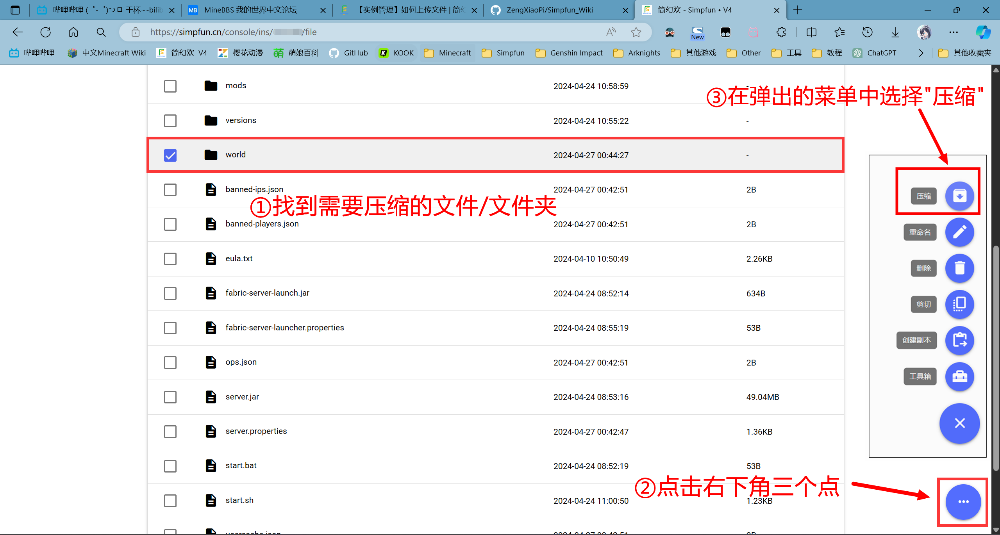
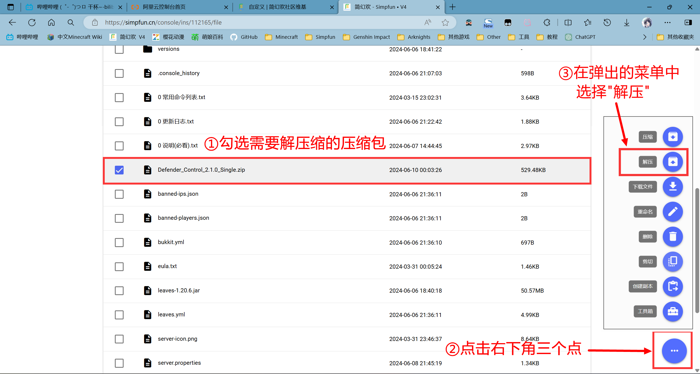

:::caution

有的时候可能由于压缩格式，压缩算法，压缩包损坏等问题无法解压缩文件，您只能通过[如何使用 SFTP 管理文件](30-sftp.md)教程以使用SFTP传输文件夹。

:::

## 压缩

1. 进入实例，点击`文件`
2. 勾选需要压缩的文件/文件夹
3. 右下角三个点选择压缩即可

等待任务执行完成后，回到`文件`页面，在服务器根目录下找到类似`compressed20240426165745.zip`的压缩文件，如下图所示：

compressed后的数字即代表文件完成压缩时的时间(精确到秒)。

## 解压缩

1. 进入实例，点击`文件`
2. 勾选压缩包左边的方框
3. 右下角三个点选择解压即可

等待任务执行完成后，您可以在`文件`页面找到已解压好的文件。

## 进阶操作：使用面板命令行进行压缩/解压缩

[请移步这篇文档查看](./Advancedoperations/1-zip_in_start_sh.md)
