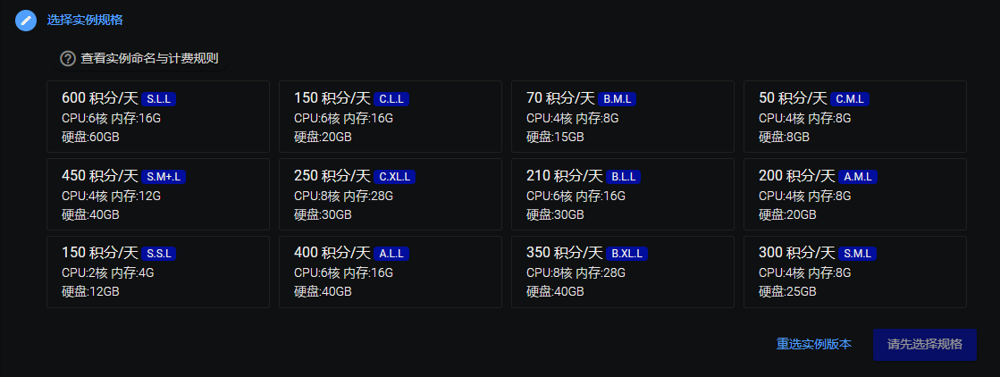
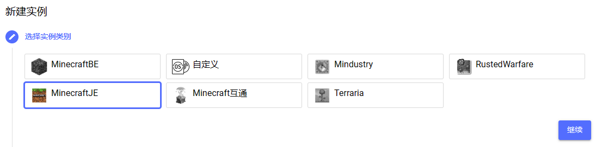
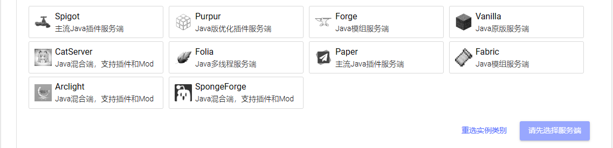

# 没写完别卡

本文档介绍开服应该有的最基本的常识和需要用到的电脑常识，建议先阅览一遍本文档后再阅读其他文档和向其他人询问，可以便于理解。

## “服务器”是什么？

**通常来讲，我的世界、泰拉瑞亚、铁锈战争等想要实现云服联机，所需的“服务器”分为两个部分：硬件和软件。**

所谓“**硬件**”，就是CPU、GPU、（APU）、存储器等这些实际完成运算的电子元件，通俗来讲，手机、电脑、iPad属于硬件，在简幻欢SFE4里，硬件是如下图的`S、A、B、C`型号的CPU。

一般来说，硬件性能决定了设备一定时间内能完成多少运算，如果服务器运行正常时出现频繁卡顿~~Can't keep up! Is the server overloaded? Running 114514ms or 1919810 ticks behind~~，可能需要考虑升级或更换更适合的硬件。

-----

所谓“**软件**”，是运行在硬件上的应用程序，操作系统、微信、QQ还有玩的电子游戏都属于软件，在简幻欢SFE4里，软件是选择实例时的游戏、服务端和运行系统，如下图都是软件。

一般来说，软件的不同会导致功能、特性、玩法的不同，也可能因为优化原因导致卡顿或者配置错误使服务器出错，如果服务器运行不正常，请检查软件配置。

**开服中绝大部分的问题和功能都属于在软件，下面将着重介绍软件部分。**

## 

