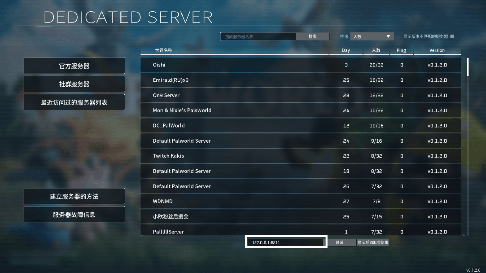
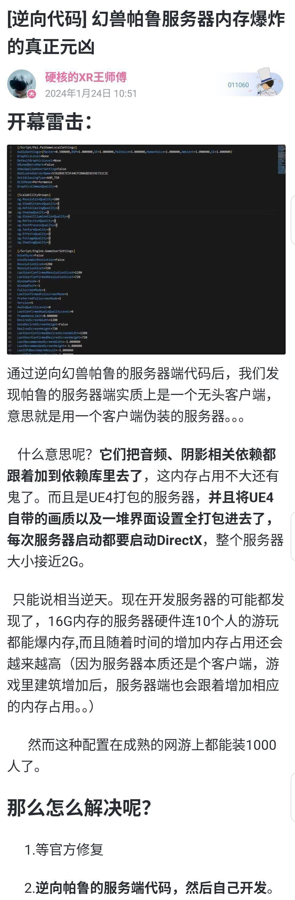

本文档会介绍一些有关幻兽服务器的信息。

:::info
幻兽发售距离撰稿仅不到十余天，目前各种信息都有出错甚至严重谬误的可能，因此此文档的信息在得到进一步核实后可能会进行更改。我们欢迎您积极指出文档中的错误，您可以在GitHub上向我们反馈或直接提交pr申请合并。在通过审核后您的更改会得到采用。
:::

## “社群服务器”

社群服务器是由玩家自行架设的服务器。如果经由steam验证，在您开启`COMMUNITY=true`后，您的服务器可以显示在专用服务器的列表中。

在SFE4中，您选择“Palworld”镜像创建实例成功后，我们已自动配置好服务器的后台设置。您只需要在游戏内输入您的服务器IP+端口即可进入服务器游玩。

（输入位置如下图）

### 唉呀，我的玩家数据怎么丢了

您可能遇到过此类问题：某一次上线服务器发现自己曾经建立的营地和帕鲁都还在原地，登入服务器的自己却重新从创建角色的页面开始。

`这种情况和幻兽服务器的验证策略有关。您应该或多或少听说过，幻兽的学习版和正版可以无缝联机，之间根本没有区别————而经过笔者实测，破解版的幻兽也可以直接进入社区服务器，和正版并无二样。这就说明，您登入幻兽的服务器时，服务器没有执行任何验证或标记玩家身份的操作，比如在云端通过登录凭证而获取玩家数据；同时，在steam购买并下载完成幻兽后，并不需要任何的第三方账户或steam账户登入，一切游戏都在**没有账户登入**的情况下进行。

这标识着，服务器区分每一个玩家，只能从玩家与服务器建立连接时自带的信息中选几个用来标识。比如————IP地址或设备mac地址。

众所周知的情况，国内v4 IP资源紧缺，导致的现象就是玩家每次连入服务器所使用的都可能是不同的IP地址；同时，有些设备有在不同的无线局域网间使用不同mac地址的功能（如iPad）。综合以上因素，每次连入服务器时，均有丢失数据的风险。`实际是记录steam的信息,实测不同账号,你甚至可以伪造id来盗取装备

**我遇到这种情况该怎么办？**

在幻兽官方更新并修复此问题前，我们没有看到有幻兽帕鲁存档的解包能证明服务器表示玩家所用的信息究竟是什么，同时笔者提出的黑盒测试也苦于没有朋友而无法实施`¯\_ (ツ)_/¯` 所以我们目前只能推荐您手动迁移数据来恢复您的存档。

**注意：此方法必须使用俺寻思之力进行，严谨性欠佳，我们欢迎您提出新的可靠有效方法。**

您的玩家数据存储在以下目录：`/Pal/Saved/SaveGames/0/随机生成的存档uid/Players/您的玩家uid.sav`。根据**俺寻思之力**，您最后一次登入的数据文件应该创建时间最晚、修改时间最新同时文件大小最小；服务器中的其他人，创建时间正常、修改时间为玩家最后退出时间同时文件大小正常；您丢失掉的数据文件，创建时间正常、修改时间为上次退出时间同时文件大小可能稍小可能正常。

在大致定位到数据后，您便可以把您新的数据文件的文件名更换给原先的数据，新的数据可以改后缀名或者改名字————只要服务器把原来的数据认为是现在的数据就可以。

（此方法使用俺寻思之力非常多，所以建议您提前备份数据。）

### 破解版与联机

上一条中讲过幻兽帕鲁目前没有正版验证，所以离线玩家也可以进入社群服务器游玩。

同时，有人通过将steam版中与steam协作达成p2p联机的文件（即联机补丁）移植给离线版，实现了离线版也能使用steam p2p联机的功能（就是那个仅限4人的通过steam联机）。详细可在b站搜索，这里不作更多叙述。

### 服务端优化问题

我不是很想再说一遍了，直接放图。

顺便给一下图中文章的原链接:[https://www.bilibili.com/read/cv30007676/](https://www.bilibili.com/read/cv30007676/)
<!-- 我也不清楚这给了个什么逆天双重恋接。哦恋爱循环连接真好看-->

