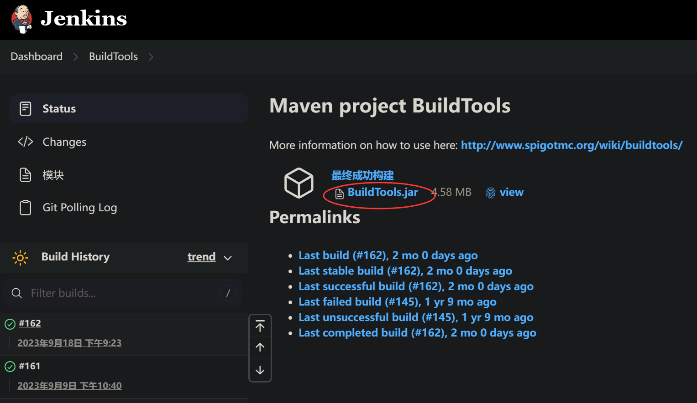
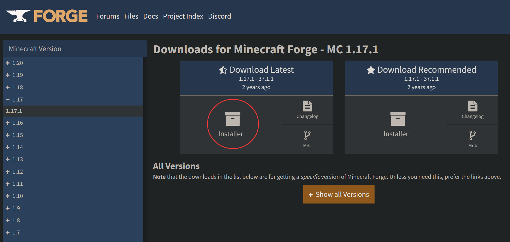
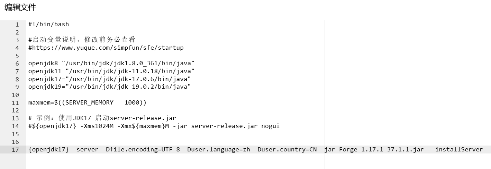

发现你需要的MCJE服务端缺失？那么这份教程正是你所需的！

:::warning 写在最前面的警告

+ 如果你打算使用自定义开服的话，请确保你已经具备了一定的开服经验和英文阅读水平。没有这方面的经验不要轻易尝试这部分的内容！  
+ 这篇教程不保证覆盖所有服务端类型。如果您发现某种服务端缺少相关教程，请到Github[提交issue](https://github.com/ZengXiaoPi/Simpfun_Wiki/issues)或者[发起Pull Requests](https://github.com/ZengXiaoPi/Simpfun_Wiki/pulls)。我们欢迎大家参与完善文档。
:::

此篇教程分为四个部分，**电脑访问的用户请使用右侧目录栏快速跳转。**

+ Vanilla端/大部分Bukkit系服务端
+ Spigot服务端
+ Forge服务端
+ Fabric服务端

## Vanilla/大部分Bukkit系服务端

Vanilla与大部分Bukkit系服务端较为简单（Spigot除外），此处以**Paper1.19.2**进行演示。服务器使用简幻欢Java(Linux)自定义镜像。

### 第一步：下载服务端核心

在[Paper构建站](https://papermc.io/downloads/all)下载对应版本的服务端核心。


:::info 其他服务端下载地址

Vanilla(原版)服务端下载：

+ 官方(不建议，只能下载到最新版本)：[https://www.minecraft.net/zh-hans/download/server](https://www.minecraft.net/zh-hans/download/server)
+ 国内镜像站(最低仅有1.16.5)：[https://www.fastmirror.net/#/download/Vanilla](https://www.fastmirror.net/#/download/Vanilla?coreVersion=release)
+ 国外镜像站(最低1.2.5，下载的时候点文件名，别点create a server)：[https://getbukkit.org/download/vanilla](https://getbukkit.org/download/vanilla)

其他Bukkit系服务端核心下载地址(没有Spigot，因为它在下一部分)：

+ Paper
  + 国内镜像站：[https://www.fastmirror.net/#/download/Paper](https://www.fastmirror.net/#/download/Paper)
+ Purpur
  + 官方：[https://purpurmc.org/downloads](https://purpurmc.org/downloads)
  + 国内镜像站：[https://www.fastmirror.net/#/download/Purpur](https://www.fastmirror.net/#/download/Purpur)  
+ Leaves：
  + 官方：[https://leavesmc.top/downloads/all](https://leavesmc.top/downloads/all)
+ Folia：
  + 官方(需要手动构建)：[https://github.com/PaperMC/Folia](https://github.com/PaperMC/Folia)  
  + 国内镜像站(已构建好)：[https://www.fastmirror.net/#/download/Folia](https://www.fastmirror.net/#/download/Folia)

:::

### 第二步：上传服务端核心

上传你下载好的服务端核心到简幻欢的根目录。

确定服务端核心已上传后，**记住文件名（包括后缀名!）**。

打开根目录下的 `start.sh` (在Windows镜像下为`start.cmd`)，添加一行类似下面的命令后保存(不要删除文件里原本的东西，除了最下面那行echo)：

```ini
${openjdk17} -server -Xms1024M -Xmx${maxmem}M -jar paper-1.19.2-307.jar nogui
```

:::info

关于各项参数的说明：

`{openjdk17}`：调用变量`openjdk17`。这个变量在上面的默认内容里被定义过了。1.16.5及以下版本的服务端请将`openjdk17`改为`openjdk8`或`openjdk11`。

`-server`：用于指示 JVM（Java虚拟机）在服务器环境中运行。这个参数实际上是一个优化标记，它告诉JVM使用更适合长时间运行和高性能的配置。

`-Xms1024M`：服务器运行最小内存为1024Mib。你可以更改`1024M`这个值：如果觉得最小运存太大可以改为`512M`或其他值，只要数字部分是4的倍数；如果强迫症不想使用M作为单位，可以改为`1G`，效果同样。

`Xmx${maxmem}M`：服务器运行最大内存为maxmxm M。maxmxm是上文定义的变量，为服务器最大物理内存-1000（单位M）。如果不想要这个~~烦人的~~变量名可以把`${maxmem}`整个改成数字，让它变得和`Xmx`这一项看起来一样。**注：`Xmx`与`Xms`均不要设为超出实例运行内存上限的值，也不要设反了让最大值比最小值小，会导致服务器无法启动！**

`-jar`：告诉Java你要启动jar文件。此项不要调整。

`paper-1.19.2-307.jar`：服务端核心名称，**改成自己上传的，包括刚才让你记的后缀名！！**

`nogui`：不启用MC服务端自带的一个GUI窗口，在面板服/命令行环境运行服务端时不能删！


:::

调整完的启动命令应类似下图所示：


### 第三步：下载依赖文件

回到`终端`界面，点击右上角的`启动`，并等待文件下载完成。

下载完成后终端会输出类似下面的提示并停止运行：

```text
[15:44:52 WARN]: Failed to load eula.txt
[15:44:52 INFO]: You need to agree to the EULA in order to run the server. Go to eula.txt for more info.
```

### 第四步：同意EULA

进入`文件`页面，打开根目录下的`eula.txt`。

```ini
#By changing the setting below to TRUE you are indicating your agreement to our EULA (https://aka.ms/MinecraftEULA).
#Fri Nov 17 15:44:52 CST 2023
eula=false
```

将其中的`false`改为`true`。

:::warning 提示

将eula中的`false`改为`true`即视为你已阅读并同意[《MINECRAFT 最终用户许可协议(EULA)》](https://www.minecraft.net/zh-hans/eula)!

:::

回到`终端`界面，点击右上角的`启动`，等待服务器生成文件。
看到类似以下的提示即可关闭服务端：

```text
[15:58:15 INFO]: Done (34.635s)! For help, type "help"
```

### 第五步：根据需要修改server.properties

再次进入`文件`页面，打开根目录下的`server.properties`。  

简幻欢在上一步启动服务端生成文件时已自动修改`server-ip`为`0.0.0.0`，`server-port`为你实例分配到的端口号，因此可以不用管这两个。  

如果你或者你的朋友没有正版账户，请把`online-mode`的值由`true`改为`false`。  

**更多关于服务器设置的配置请查看[这篇文档](../mcje/20-serverproperties.md)。**

Vanilla服务端无法装载mod/插件。
Bukkit系服务端需要装载插件就将插件放到`/plugins`文件夹。

需要更换存档请参考[这篇文档](../mcje/7-filestructure.md)。

现在你已经配置好服务端了，去进行愉快的游戏吧！

## Spigot服务端

:::info

Spigot端由于其[历史原因](https://zhuanlan.zhihu.com/p/446941433)，官网给的下载链接是一个构建工具，你需要自己下载后手动构建。
但其实你可以选择去找镜像站下载已构建完成的Spigot服务端。
下方教程为使用Buildtools手动构建Spigot。
:::

### 第一步：构建服务端核心

前往[Spigot构建站](https://hub.spigotmc.org/jenkins/job/BuildTools/)下载`Buildtools.jar`。



**如果你有电脑：**

将`BuildTools.jar`挪到一个空文件夹，并新建一个文本文档，重命名为`build.bat`(删掉原本的.txt后缀)，并将以下内容写入进此bat文件：

```text
"C:\Program Files\Zulu\zulu-21\bin\java.exe" -Xmx1500m -jar BuildTools.jar --rev 版本号
pause
```

"C:\Program Files\Zulu\zulu-21\bin\java.exe"请换成你的java.exe所在目录。
--rev后的版本号换成你想构建的那个版本，例如`1.19.3`，当设置为`latest`时构建最新版本。  
保存完成后即可双击此bat文件，等待服务端构建完毕。  

构建完成后将服务端上传至实例文件的根目录。  

**如果你没有电脑：**  

将`BuildTools.jar`上传至实例文件的根目录，并在根目录下的`start.sh`文件内添加一行下面的命令后保存(不要删除start.sh自带的东西，echo那一行除外)：

```text
${openjdk17} -Xmx1500m -jar BuildTools.jar --rev 版本号
```
--rev后的版本号换成你想构建的那个版本，例如`1.19.3`，当设置为`latest`时构建最新版本。


保存完成后启动实例，等待服务端构建完毕。

:::info 或者...  

前往下方镜像站下载已构建完成的Spigot服务端：

+ Fastmirror(国内站)：[https://www.fastmirror.net/#/download/Spigot](https://www.fastmirror.net/#/download/Spigot)
+ Getbukkit(国外站，下载的时候点文件名，别点create a server)：[https://getbukkit.org/download/spigot](https://getbukkit.org/download/spigot)

:::

### 第二步：调整命令

确定服务端核心已上传后，**记住文件名（包括后缀名!）**。

打开根目录下的 `start.sh` (在Windows镜像下为`start.cmd`)，先把第一步添加的这行命令删除：

```text
${openjdk17} -Xmx1500m -jar BuildTools.jar --rev 版本号
```

然后再添加一行类似下面的命令后保存(不要删除文件里原本的东西，除了最下面那行echo)：

```ini
${openjdk17} -server -Xms1024M -Xmx${maxmem}M -jar Spigot-1.20.2-3941.jar nogui
```

:::info

关于各项参数的说明：

`{openjdk17}`：调用变量`openjdk17`。这个变量在上面的默认内容里被定义过了。1.16.5及以下版本的服务端请将`openjdk17`改为`openjdk8`或`openjdk11`。

`-server`：用于指示 JVM（Java虚拟机）在服务器环境中运行。这个参数实际上是一个优化标记，它告诉JVM使用更适合长时间运行和高性能的配置。

`-Xms1024M`：服务器运行最小内存为1024Mib。你可以更改`1024M`这个值：如果觉得最小运存太大可以改为`512M`或其他值，只要数字部分是4的倍数；如果强迫症不想使用M作为单位，可以改为`1G`，效果同样。

`Xmx${maxmem}M`：服务器运行最大内存为maxmxm M。maxmxm是上文定义的变量，为服务器最大物理内存-1000（单位M）。如果不想要这个~~烦人的~~变量名可以把`${maxmem}`整个改成数字，让它变得和`Xmx`这一项看起来一样。**注：`Xmx`与`Xms`均不要设为超出实例运行内存上限的值，也不要设反了让最大值比最小值小，会导致服务器无法启动！**

`-jar`：告诉Java你要启动jar文件。此项不要调整。

`Spigot-1.20.2-3941.jar`：服务端核心名称，**改成自己上传的，包括刚才让你记的后缀名！！**

`nogui`：不启用MC服务端自带的一个GUI窗口，在面板服/命令行环境运行服务端时不能删！


:::

调整完的启动命令应类似下图所示：


此时你可以将`BuildTools.jar`删除了。

### 第三步：下载依赖文件

回到`终端`界面，点击右上角的`启动`，并等待文件下载完成。

下载完成后终端会输出类似下面的提示并停止运行：

```text
[15:44:52 WARN]: Failed to load eula.txt
[15:44:52 INFO]: You need to agree to the EULA in order to run the server. Go to eula.txt for more info.
```

### 第四步：同意EULA

进入`文件`页面，打开根目录下的`eula.txt`。

```ini
#By changing the setting below to TRUE you are indicating your agreement to our EULA (https://aka.ms/MinecraftEULA).
#Fri Nov 17 15:44:52 CST 2023
eula=false
```

将其中的`false`改为`true`。

:::warning 提示

将eula中的`false`改为`true`即视为你已阅读并同意[《MINECRAFT 最终用户许可协议(EULA)》](https://www.minecraft.net/zh-hans/eula)!

:::

回到`终端`界面，点击右上角的`启动`，等待服务器生成文件。
看到类似以下的提示即可关闭服务端：

```text
[15:58:15 INFO]: Done (34.635s)! For help, type "help"
```

### 第五步：根据需要修改server.properties

再次进入`文件`页面，打开根目录下的`server.properties`。  

简幻欢在上一步启动服务端生成文件时已自动修改`server-ip`为`0.0.0.0`，`server-port`为你实例分配到的端口号，因此可以不用管这两个。  

如果你或者你的朋友没有正版账户，请把`online-mode`的值由`true`改为`false`。  

**更多关于服务器设置的配置请查看[这篇文档](../mcje/20-serverproperties.md)。**

Spigot服务端需要装载插件就将插件放到`/plugins`文件夹。

需要更换存档请参考[这篇文档](../mcje/7-filestructure.md)。

现在你已经配置好服务端了，去进行愉快的游戏吧！

## Forge服务端

:::caution 提示

从 Minecraft 1.17.1 开始，Forge的启动命令是启动一个txt文件，你在根目录下是找不到Forge/Vanilla核心的！  
~~要我说这改的就是托史~~  
此部分仅介绍1.17.1+的Forge服务端安装方式。

啥？~~你还是1.12.2钉子户？~~你还在使用老版本？看[这篇文档](./2-mcje-ForgeOldVersionServer.md)
:::

### 第一步：构建服务端

打开[Forge官网](https://files.minecraftforge.net/net/minecraftforge/forge/)，选择你需要的版本的Forge安装器进行下载，此处以1.17.1为例，点击红圈处下载Forge安装器。



下载完成后将其上传至实例文件的根目录。

打开根目录下的`start.sh`，在文件内添加一行下面的命令后保存(不要删除start.sh自带的东西，echo那一行除外)：

```text
${openjdk17} -server -Dfile.encoding=UTF-8 -Duser.language=zh -Duser.country=CN -jar [Forge安装器文件名].jar --installServer
```

ps:去除方括号

如下图所示：


回到`终端`界面，启动实例，等待服务端构建完成后会出现以下输出并停止运行。

```text
The server installed successfully
You can delete this installer file now if you wish
```


### 第二步：调整启动命令

转到`文件`界面，打开根目录下自动生成的`run.sh`，复制类似下方的命令(最前面的java不用复制)：

```
@user_jvm_args.txt @libraries/net/minecraftforge/forge/1.17.1-37.1.1/unix_args.txt "$@"
```

打开`start.sh`，删除第一步中添加的命令，防止重新构建毁坏服务端，并添加一行类似下方的命令后保存：

```
${openjdk17} -server -Xms1024m -Xmx${maxmem}M @user_jvm_args.txt @libraries/net/minecraftforge/forge/1.17.1-37.1.1/unix_args.txt "$@" nogui
```

:::info

关于各项参数的说明：

`{openjdk17}`：调用变量`openjdk17`。这个变量在上面的默认内容里被定义过了。

`-server`：用于指示 JVM（Java虚拟机）在服务器环境中运行。这个参数实际上是一个优化标记，它告诉JVM使用更适合长时间运行和高性能的配置。

`-Xms1024M`：服务器运行最小内存为1024Mib。你可以更改`1024M`这个值：如果觉得最小运存太大可以改为`512M`或其他值，只要数字部分是4的倍数；如果强迫症不想使用M作为单位，可以改为`1G`，效果同样。

`-Xmx${maxmem}M`：服务器运行最大内存为maxmxm M。maxmxm是上文定义的变量，为服务器最大物理内存-1000（单位M）。如果不想要这个~~烦人的~~变量名可以把`${maxmem}`整个改成数字，让它变得和`Xmx`这一项看起来一样。**注：`Xmx`与`Xms`均不要设为超出实例运行内存上限的值，也不要设反了让最大值比最小值小，会导致服务器无法启动！**

`@user_jvm_args.txt @libraries/net/minecraftforge/forge/1.17.1-37.1.1/unix_args.txt "$@"`：这个命令是用于启动 Minecraft Forge 1.17.1-37.1.1 的一系列参数设置。它包括引用用户定义的 JVM 参数文件和 Forge 所需的 UNIX 系统下启动参数文件，然后将这些参数传递给 Forge 的执行命令。不同Forge版本此参数里的版本号不同。

`nogui`：不启用MC服务端自带的一个GUI窗口，在面板服/命令行环境运行服务端时不能删！

:::

调整完的启动命令应类似下图所示：


此时你可以将Forge安装器删除了。

### 第三步：同意EULA

启动服务器，稍微等待一会后会出现类似如下的提示并关闭服务器：

```text
[16:28:45] [main/INFO] [minecraft/Main]: You need to agree to the EULA in order to run the server. Go to eula.txt for more info.
```

转到`文件`页面，打开根目录下的`eula.txt`。

```ini
#By changing the setting below to TRUE you are indicating your agreement to our EULA (https://aka.ms/MinecraftEULA).
#Sat Nov 18 16:28:45 CST 2023
eula=false
```

将其中的`false`改为`true`。

:::warning 提示

将eula中的`false`改为`true`即视为你已阅读并同意[《MINECRAFT 最终用户许可协议(EULA)》](https://www.minecraft.net/zh-hans/eula)!

:::

回到`终端`界面，点击右上角的`启动`，等待服务器生成文件。
看到类似以下的提示即可关闭服务端：

```text
[16:30:15 INFO]: Done (27.102s)! For help, type "help"
```

### 第四步：根据需要修改server.properties

再次进入`文件`页面，打开根目录下的`server.properties`。  

简幻欢在上一步启动服务端生成文件时已自动修改`server-ip`为`0.0.0.0`，`server-port`为你实例分配到的端口号，因此可以不用管这两个。  

如果你或者你的朋友没有正版账户，请把`online-mode`的值由`true`改为`false`。  

**更多关于服务器设置的配置请查看[这篇文档](../mcje/20-serverproperties.md)。**

<!-- Spigot服务端需要装载插件就将插件放到`/plugins`文件夹。 -->

需要更换存档请参考[这篇文档](../mcje/7-filestructure.md)。

现在你已经配置好服务端了，去进行愉快的游戏吧！

## Fabric服务端

### 第一步：构建服务端核心+下载依赖文件

前往[Fabric官网](https://fabricmc.net/use/installer/)，点击`Download universal jar`下载构建器。


下载完成后将其上传至实例文件的根目录。

打开根目录下的`start.sh`，在文件内添加一行下面的命令后保存(不要删除start.sh自带的东西，echo那一行除外)：

```text
${openjdk17} -jar <构建器文件名>.jar server -mcversion <MC版本号> -downloadMinecraft
```

:::info 提示

<构建器文件名>换成你下载到的构建器的文件名(不要尖括号)
<版本号>换成你需要的服务端版本，例如`1.19.3`(不要尖括号)

:::

保存后回到`终端`页面，启动服务器，此时构建器将会自动构建服务端核心并下载依赖文件。

完成后服务器将会停止运行。

### 第二步：调整启动命令

打开根目录下的 `start.sh` (在Windows镜像下为`start.cmd`)，**先把第一步添加的那行命令删除**，然后再添加一行类似下面的命令后保存(不要删除文件里原本的东西，除了最下面那行echo)：

```ini
${openjdk17} -server -Xms1024M -Xmx${maxmem}M -jar fabric-server-launch.jar -nogui
```

:::info

关于各项参数的说明：

`{openjdk17}`：调用变量`openjdk17`。这个变量在上面的默认内容里被定义过了。

`-server`：用于指示 JVM（Java虚拟机）在服务器环境中运行。这个参数实际上是一个优化标记，它告诉JVM使用更适合长时间运行和高性能的配置。

`-Xms1024M`：服务器运行最小内存为1024Mib。你可以更改`1024M`这个值：如果觉得最小运存太大可以改为`512M`或其他值，只要数字部分是4的倍数；如果强迫症不想使用M作为单位，可以改为`1G`，效果同样。

`-Xmx${maxmem}M`：服务器运行最大内存为maxmxm M。maxmxm是上文定义的变量，为服务器最大物理内存-1000（单位M）。如果不想要这个~~烦人的~~变量名可以把`${maxmem}`整个改成数字，让它变得和`Xmx`这一项看起来一样。**注：`Xmx`与`Xms`均不要设为超出实例运行内存上限的值，也不要设反了让最大值比最小值小，会导致服务器无法启动！**

`-jar`：告诉Java你要启动jar文件。此项不要更改或删除。

`fabric-server-launch.jar`：Fabric构建器生成的启动Fabric服务端的文件，此项不要更改。

`-nogui`：不启用MC服务端自带的一个GUI窗口，在面板服/命令行环境运行服务端时不能删！

:::

调整完的启动命令应类似下图所示：


此时你可以删除Fabric构建器了。

### 第三步：同意EULA

启动服务器，稍微等待一会后会出现类似如下的提示并关闭服务器：

```text
[21:32:42] [main/INFO] [minecraft/Main]: You need to agree to the EULA in order to run the server. Go to eula.txt for more info.
```

转到`文件`页面，打开根目录下的`eula.txt`。

```ini
#By changing the setting below to TRUE you are indicating your agreement to our EULA (https://aka.ms/MinecraftEULA).
#Sat Nov 18 21:32:42 CST 2023
eula=false
```

将其中的`false`改为`true`。

:::warning 提示

将eula中的`false`改为`true`即视为你已阅读并同意[《MINECRAFT 最终用户许可协议(EULA)》](https://www.minecraft.net/zh-hans/eula)!

:::

回到`终端`界面，点击右上角的`启动`，等待服务器生成文件。
看到类似以下的提示即可关闭服务端：

```text
[21:33:52 INFO]: Done (38.223s)! For help, type "help"
```

### 第四步：根据需要修改server.properties

再次进入`文件`页面，打开根目录下的`server.properties`。  

简幻欢在上一步启动服务端生成文件时已自动修改`server-ip`为`0.0.0.0`，`server-port`为你实例分配到的端口号，因此可以不用管这两个。  

如果你或者你的朋友没有正版账户，请把`online-mode`的值由`true`改为`false`。  

**更多关于服务器设置的配置请查看[这篇文档](../mcje/20-serverproperties.md)。**

Spigot服务端需要装载插件就将插件放到`/plugins`文件夹。

需要更换存档请参考[这篇文档](../mcje/7-filestructure.md)。

现在你已经配置好服务端了，去进行愉快的游戏吧！