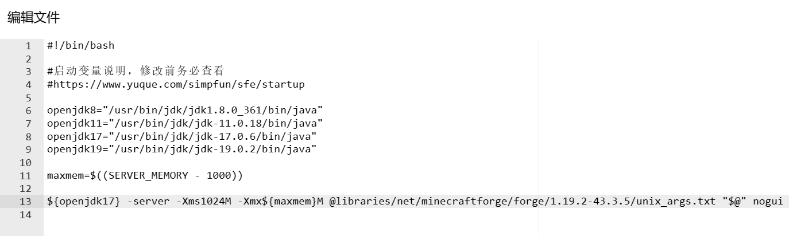
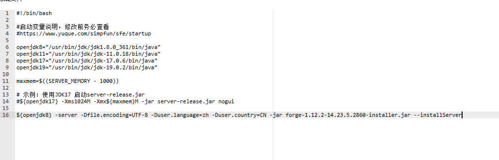
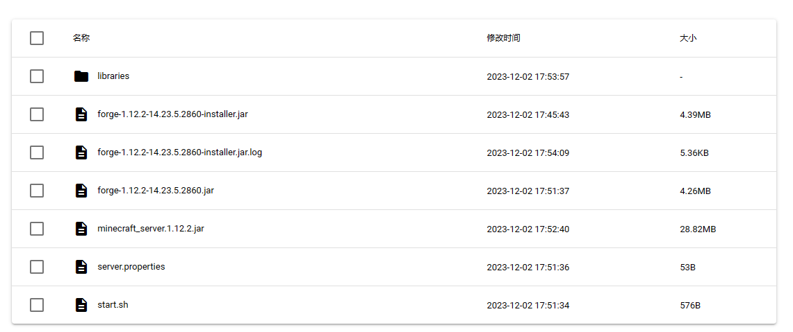
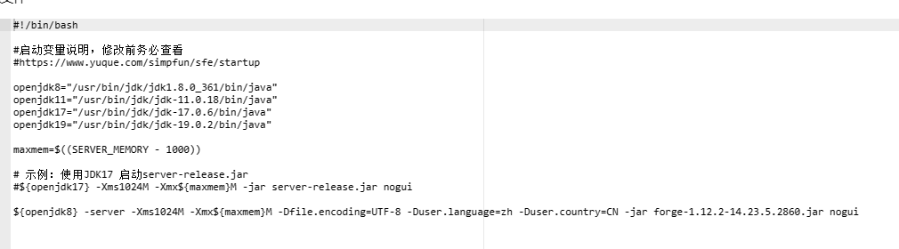

简幻欢预设的Forge版本过低？来看这篇文档！

## 视频教程

[点此跳转至B站观看](https://www.bilibili.com/video/av1254877718)

## 1.17.1及以上版本的服务端

:::caution 提示

- 从 1.17.1 开始，Forge的启动命令是启动一个txt文件，你在根目录下是找不到Forge/Vanilla核心的！  

- 从 1.20.4 开始，Forge在构建服务端时会在根目录生成一个类似`forge-1.20.6-50.0.29-shim.jar`名字的文件，目前暂不清楚此文件有什么作用。
:::

### 第一步：构建服务端

打开[Forge官网](https://files.minecraftforge.net/net/minecraftforge/forge/)，选择你需要的版本的Forge安装器进行下载，此处以1.17.1为例，按照下图方式下载安装器可以跳过下载前的~~该死的~~广告。


:::info 提示

其他下载地址：

无极镜像(CN)：[https://www.fastmirror.net/#/download/Forge](https://www.fastmirror.net/#/download/Forge)

:::

下载完成后将其上传至实例文件的根目录。

打开根目录下的`start.sh`，在文件内添加一行下面的命令后保存(不要删除start.sh自带的东西，echo那一行除外)：

```text
${openjdk17} -server -Dfile.encoding=UTF-8 -Duser.language=zh -Duser.country=CN -jar [Forge/NeoForge安装器文件名].jar --installServer
```

ps:去除方括号

如下图所示：


回到`终端`界面，启动实例，等待服务端构建完成后会出现以下输出并停止运行。

```text
The server installed successfully
You can delete this installer file now if you wish
```

### 第二步：调整启动命令

转到`文件`界面，打开根目录下自动生成的`run.sh`，复制类似下方的命令(最前面的java不用复制)：

```shell
@libraries/net/minecraftforge/forge/1.17.1-37.1.1/unix_args.txt "$@"
```

打开`start.sh`，删除第一步中添加的命令，防止重新构建毁坏服务端，并添加一行类似下方的命令后保存：

```shell
${openjdk17} -server -Xms1024m -Xmx${maxmem}M @libraries/net/minecraftforge/forge/1.17.1-37.1.1/unix_args.txt "$@" nogui
```

:::info

关于各项参数的说明：

`{openjdk17}`：调用变量`openjdk17`。这个变量在上面的默认内容里被定义过了。

`-server`：用于指示 JVM（Java虚拟机）在服务器环境中运行。这个参数实际上是一个优化标记，它告诉JVM使用更适合长时间运行和高性能的配置。

`-Xms1024M`：服务器运行最小内存为1024Mib。你可以更改`1024M`这个值：如果觉得最小运存太大可以改为`512M`或其他值，只要数字部分是4的倍数；如果强迫症不想使用M作为单位，可以改为`1G`，效果同样。

`-Xmx${maxmem}M`：服务器运行最大内存为maxmxm M。maxmxm是上文定义的变量，为服务器最大物理内存-1000（单位M）。如果不想要这个~~烦人的~~变量名可以把`${maxmem}`整个改成数字，让它变得和`Xmx`这一项看起来一样。**注：`Xmx`与`Xms`均不要设为超出实例运行内存上限的值，也不要设反了让最大值比最小值小，会导致服务器无法启动！**

`@libraries/net/minecraftforge/forge/1.17.1-37.1.1/unix_args.txt "$@"`：这个命令是用于启动 Minecraft Forge 1.17.1-37.1.1 的一系列参数设置。它包括引用用户定义的 JVM 参数文件和 Forge 所需的 UNIX 系统下启动参数文件，然后将这些参数传递给 Forge 的执行命令。不同Forge版本此参数里的版本号不同。

`nogui`：不启用MC服务端自带的一个GUI窗口，在面板服/命令行环境运行服务端时不能删！

:::

调整完的启动命令应类似下图所示：



此时你可以将Forge/NeoForge安装器删除了。

### 第三步：同意EULA

启动服务器，稍微等待一会后会出现类似如下的提示并关闭服务器：

```text
[16:28:45] [main/INFO] [minecraft/Main]: You need to agree to the EULA in order to run the server. Go to eula.txt for more info.
```

转到`文件`页面，打开根目录下的`eula.txt`。

```ini
#By changing the setting below to TRUE you are indicating your agreement to our EULA (https://aka.ms/MinecraftEULA).
#Sat Nov 18 16:28:45 CST 2023
eula=false
```

将其中的`false`改为`true`。

:::warning 提示

将eula中的`false`改为`true`即视为你已阅读并同意[《MINECRAFT 最终用户许可协议(EULA)》](https://www.minecraft.net/zh-hans/eula)!

:::

回到`终端`界面，点击右上角的`启动`，等待服务器生成文件。
看到类似以下的提示即可关闭服务端：

```text
[16:30:15 INFO]: Done (27.102s)! For help, type "help"
```

### 第四步：配置服务端

再次进入`文件`页面，打开根目录下的`server.properties`。  

简幻欢在上一步启动服务端生成文件时已自动修改`server-ip`为`0.0.0.0`，`server-port`为你实例分配到的端口号，因此可以不用管这两个。  

如果你或者你的朋友没有正版账户，请把`online-mode`的值由`true`改为`false`。  

**更多关于服务器设置的配置请查看[这篇文档](../mcje/20-serverproperties.md)。**

Mod文件放入`mods`文件夹。

需要更换存档请参考[这篇文档](../mcje/25-Upload-worlds.md)。

现在你已经配置好服务端了，去愉快的玩游戏吧！

## 1.7.10——1.16.5版本的服务端

1.16.5及以下版本的Forge服务端是使用一个jar文件启动的。

### 第一步：安装服务端

打开[Forge官网](https://files.minecraftforge.net/net/minecraftforge/forge/)，选择你需要的版本的Forge安装器进行下载，此处以1.12.2为例，按照下图方式下载Forge安装器。


:::info 其他下载地址

无极镜像(CN)：[https://www.fastmirror.net/#/download/Forge](https://www.fastmirror.net/#/download/Forge)

:::

下载完成后将其上传至实例文件的根目录。

打开根目录下的`start.sh`，在文件内添加一行下面的命令后保存(不要删除start.sh自带的东西，echo那一行除外)：

```shell
${openjdk8} -server -Dfile.encoding=UTF-8 -Duser.language=zh -Duser.country=CN -jar [Forge安装器文件名].jar --installServer
```

ps:去除方括号

如下图所示：


回到`终端`界面，启动实例，等待服务端构建完成后会出现以下输出并停止运行。

```text
The server installed successfully
You can delete this installer file now if you wish
```

### 第二步：调整启动命令

打开`start.sh`，删除第一步中添加的命令，防止重新构建毁坏服务端，并添加一行类似下方的命令后保存：

`[服务端名字]`是指例如下面目录
中的`forge-x.x.x-x.x.x.x.jar`，在上面目录为`forge-1.12.2-14.23.5.2860.jar`。

:::caution 提示

不要试图启动`minecraft_server.x.x.x.jar`，不然喜提不加载mod（

:::

```shell
${openjdk8} -server -Xms1024M -Xmx${maxmem}M -Dfile.encoding=UTF-8 -Duser.language=zh -Duser.country=CN -jar [服务端名字] nogui
```

:::info

关于各项参数的说明：

`{openjdk8}`：调用变量`openjdk8`。这个变量在上面的默认内容里被定义过了。

`-server`：用于指示 JVM（Java虚拟机）在服务器环境中运行。这个参数实际上是一个优化标记，它告诉JVM使用更适合长时间运行和高性能的配置。

`-Xms1024M`：服务器运行最小内存为1024Mib。你可以更改`1024M`这个值：如果觉得最小运存太大可以改为`512M`或其他值，只要数字部分是4的倍数；如果强迫症不想使用M作为单位，可以改为`1G`，效果同样。

`-Xmx${maxmem}M`：服务器运行最大内存为maxmxm M。maxmxm是上文定义的变量，为服务器最大物理内存-1000（单位M）。如果不想要这个~~烦人的~~变量名可以把`${maxmem}`整个改成数字，让它变得和`Xmx`这一项看起来一样。**注：`Xmx`与`Xms`均不要设为超出实例运行内存上限的值，也不要设反了让最大值比最小值小，会导致服务器无法启动！**

`nogui`：不启用MC服务端自带的一个GUI窗口，在面板服/命令行环境运行服务端时不能删！

:::

调整完的启动命令应类似下图所示：



此时你可以将Forge安装器删除了。

### 第三步：同意EULA

启动服务器，稍微等待一会后会出现类似如下的提示并关闭服务器：

```text
[16:28:45] [main/INFO] [minecraft/Main]: You need to agree to the EULA in order to run the server. Go to eula.txt for more info.
```

转到`文件`页面，打开根目录下的`eula.txt`。

```ini
#By changing the setting below to TRUE you are indicating your agreement to our EULA (https://aka.ms/MinecraftEULA).
#Sat Nov 18 16:28:45 CST 2023
eula=false
```

将其中的`false`改为`true`。

:::warning 提示

将eula中的`false`改为`true`即视为你已阅读并同意[《MINECRAFT 最终用户许可协议(EULA)》](https://www.minecraft.net/zh-hans/eula)!

:::

回到`终端`界面，点击右上角的`启动`，等待服务器生成文件。
看到类似以下的提示即可关闭服务端：

```text
[16:30:15 INFO]: Done (27.102s)! For help, type "help"
```

### 第四步：根据需要配置服务端

再次进入`文件`页面，打开根目录下的`server.properties`。  

简幻欢在上一步启动服务端生成文件时已自动修改`server-ip`为`0.0.0.0`，`server-port`为你实例分配到的端口号，因此可以不用管这两个。  

如果你或者你的朋友没有正版账户，请把`online-mode`的值由`true`改为`false`。  

**更多关于服务器设置的配置请查看[这篇文档](../mcje/20-serverproperties.md)。**

需要更换存档请参考[这篇文档](../mcje/25-Upload-worlds.md)。

现在你已经配置好服务端了，去进行愉快的游戏吧！
