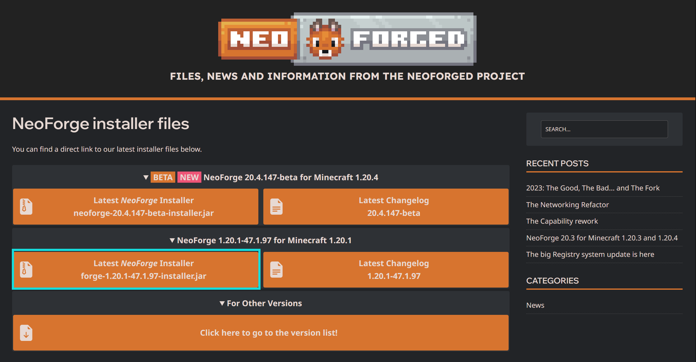
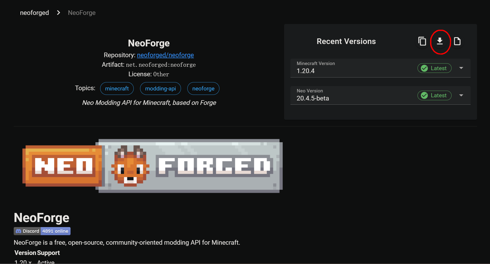
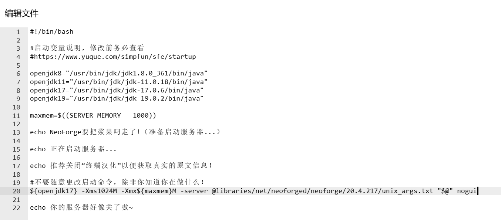

简幻欢预设的NeoForge版本过低？来看这篇文档！

:::caution 提示

从 1.17.1 开始，Forge的启动命令是启动一个txt文件，分叉后的NeoForge依旧保留了这一特性，你在根目录下是找不到NeoForge/Vanilla核心的！  

:::

### 第一步：安装服务端

1.20.1：

打开[NeoForge官网](https://neoforged.net/)，选择你需要的版本的NeoForge安装器进行下载，1.20.1为下面的那个。



1.20.2及更高版本：

打开[NeoForged项目清单](https://projects.neoforged.net/neoforged/neoforge)，在右侧选择你需要下载的MC版本与加载器版本后点击红圈处的下载。



下载完成后将其上传至实例文件的根目录。

打开根目录下的`start.sh`，在文件内添加一行下面的命令后保存(不要删除start.sh自带的东西，echo那一行除外)：

```text
${openjdk17} -server -Dfile.encoding=UTF-8 -Duser.language=zh -Duser.country=CN -jar [NeoForge安装器文件名].jar --installServer
```

ps:去除方括号

如下图所示：


回到`终端`界面，启动实例，等待服务端构建完成后会出现以下输出并停止运行。

```text
The server installed successfully
You can delete this installer file now if you wish
```

### 第二步：调整启动命令

转到`文件`界面，打开根目录下自动生成的`run.sh`，复制类似下方的命令(最前面的java不用复制)：

```shell
@libraries/net/neoforged/neoforge/20.4.217/win_args.txt "$@"
```

打开`start.sh`，删除第一步中添加的命令，防止重新构建毁坏服务端，并添加一行类似下方的命令后保存，NeoForge由于项目名称的更改，其启动命令应类似如下格式：

```sh
# 1.20.1
${openjdk17} -server -Xms1024M -Xmx${maxmem}M  @libraries/net/neoforged/forge/1.20.1-47.1.105/unix_args.txt "$@" -nogui
# 1.20.2+
${openjdk21} -server -Xms1024m -Xmx${maxmem}M @libraries/net/neoforged/neoforge/20.4.217/win_args.txt "$@" -nogui
```

:::info

关于各项参数的说明：

`{openjdk17}`：调用变量`openjdk17`。这个变量在上面的默认内容里被定义过了。

`-server`：用于指示 JVM（Java虚拟机）在服务器环境中运行。这个参数实际上是一个优化标记，它告诉JVM使用更适合长时间运行和高性能的配置。

`-Xms1024M`：服务器运行最小内存为1024Mib。你可以更改`1024M`这个值：如果觉得最小运存太大可以改为`512M`或其他值，只要数字部分是4的倍数；如果强迫症不想使用M作为单位，可以改为`1G`，效果同样。

`-Xmx${maxmem}M`：服务器运行最大内存为maxmxm M。maxmxm是上文定义的变量，为服务器最大物理内存-1000（单位M）。如果不想要这个~~烦人的~~变量名可以把`${maxmem}`整个改成数字，让它变得和`Xmx`这一项看起来一样。**注：`Xmx`与`Xms`均不要设为超出实例运行内存上限的值，也不要设反了让最大值比最小值小，会导致服务器无法启动！**

`@libraries/net/neoforged/neoforge/20.4.217/win_args.txt "$@"`：这个命令是用于启动 `Minecraft NeoForge 1.20.4-20.4.217` 的一系列参数设置。它包括引用用户定义的 JVM 参数文件和 NeoForge 所需的 UNIX 系统下启动参数文件，然后将这些参数传递给 NeoForge 的执行命令。不同NeoForge版本此参数里的版本号不同。

`nogui`：不启用MC服务端自带的一个GUI窗口，在面板服/命令行环境运行服务端时不能删！

:::

调整完的启动命令应类似下图所示：



此时你可以将Forge/NeoForge安装器删除了。

### 第三步：同意EULA

启动服务器，稍微等待一会后会出现类似如下的提示并关闭服务器：

```text
[16:28:45] [main/INFO] [minecraft/Main]: You need to agree to the EULA in order to run the server. Go to eula.txt for more info.
```

转到`文件`页面，打开根目录下的`eula.txt`。

```ini
#By changing the setting below to TRUE you are indicating your agreement to our EULA (https://aka.ms/MinecraftEULA).
#Sat Nov 18 16:28:45 CST 2023
eula=false
```

将其中的`false`改为`true`。

:::warning 提示

将eula中的`false`改为`true`即视为你已阅读并同意[《MINECRAFT 最终用户许可协议(EULA)》](https://www.minecraft.net/zh-hans/eula)!

:::

回到`终端`界面，点击右上角的`启动`，等待服务器生成文件。
看到类似以下的提示即可关闭服务端：

```text
[16:30:15 INFO]: Done (27.102s)! For help, type "help"
```

### 第四步：配置服务端

再次进入`文件`页面，打开根目录下的`server.properties`。  

简幻欢在上一步启动服务端生成文件时已自动修改`server-ip`为`0.0.0.0`，`server-port`为你实例分配到的端口号，因此可以不用管这两个。  

如果你或者你的朋友没有正版账户，请把`online-mode`的值由`true`改为`false`。  

**更多关于服务器设置的配置请查看[这篇文档](../mcje/20-serverproperties.md)。**

Mod文件放入`mods`文件夹。

需要更换存档请参考[这篇文档](../mcje/25-Upload-worlds.md)。

现在你已经配置好服务端了，去愉快的玩游戏吧！
