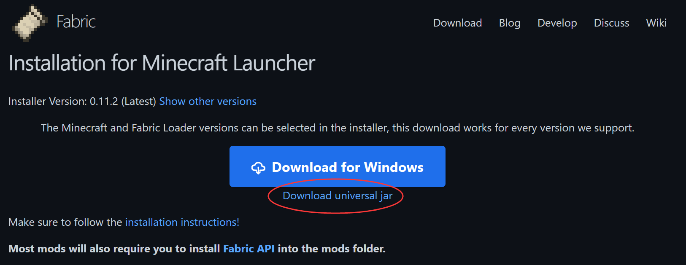
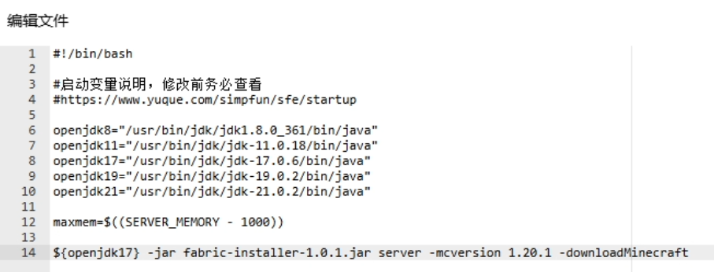
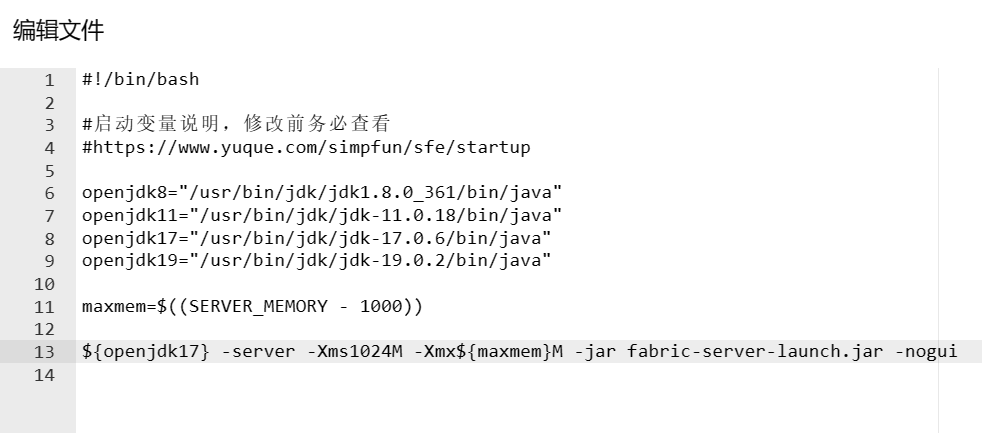

简幻欢预设的Fabric版本过低？来看这篇文档！

### 第一步：安装服务端核心

前往[Fabric官网](https://fabricmc.net/use/installer/)，点击`Download universal jar`下载通用安装器。



下载完成后将其上传至实例文件的根目录。

打开根目录下的`start.sh`，在文件内添加一行下面的命令后保存(不要删除start.sh自带的东西，echo那一行除外)：

```text
${openjdk17} -jar <安装器文件名>.jar server -mcversion <MC版本号> -downloadMinecraft
```

:::info 提示

<构建器文件名>换成你下载到的构建器的文件名(不要尖括号)
<版本号>换成你需要的服务端版本，例如`1.19.3`(不要尖括号)

:::

例如，当安装器文件名为`fabric-installer-1.0.1`，需要的服务端版本为`1.20.1`时，命令应如下图所示(第14行)：



保存后回到`终端`页面，启动服务器，此时构建器将会自动构建服务端核心并下载依赖文件。

完成后服务器将会停止运行。

### 第二步：调整启动命令

打开根目录下的 `start.sh` (在Windows镜像下为`start.cmd`)，**先把第一步添加的那行命令删除**，然后再添加一行类似下面的命令后保存(不要删除文件里原本的东西，除了最下面那行echo)：

```shell
${openjdk17} -server -Xms1024M -Xmx${maxmem}M -jar fabric-server-launch.jar -nogui
```

:::info

关于各项参数的说明：

`{openjdk17}`：调用变量`openjdk17`。这个变量在上面的默认内容里被定义过了。

`-server`：用于指示 JVM（Java虚拟机）在服务器环境中运行。这个参数实际上是一个优化标记，它告诉JVM使用更适合长时间运行和高性能的配置。

`-Xms1024M`：服务器运行最小内存为1024Mib。你可以更改`1024M`这个值：如果觉得最小运存太大可以改为`512M`或其他值，只要数字部分是4的倍数；如果强迫症不想使用M作为单位，可以改为`1G`，效果同样。

`-Xmx${maxmem}M`：服务器运行最大内存为maxmxm M。maxmxm是上文定义的变量，为服务器最大物理内存-1000（单位M）。如果不想要这个~~烦人的~~变量名可以把`${maxmem}`整个改成数字，让它变得和`Xmx`这一项看起来一样。**注：`Xmx`与`Xms`均不要设为超出实例运行内存上限的值，也不要设反了让最大值比最小值小，会导致服务器无法启动！**

`-jar`：告诉Java你要启动jar文件。此项不要更改或删除。

`fabric-server-launch.jar`：Fabric构建器生成的启动Fabric服务端的文件，此项不要更改。

`-nogui`：不启用MC服务端自带的一个GUI窗口，在面板服/命令行环境运行服务端时不能删！

:::

调整完的启动命令应类似下图所示：



此时你可以删除Fabric构建器了。

### 第三步: 同意EULA

启动服务器，稍微等待一会后会出现类似如下的提示并关闭服务器：

```text
[21:32:42] [main/INFO] [minecraft/Main]: You need to agree to the EULA in order to run the server. Go to eula.txt for more info.
```

转到`文件`页面，打开根目录下的`eula.txt`。

```ini
#By changing the setting below to TRUE you are indicating your agreement to our EULA (https://aka.ms/MinecraftEULA).
#Sat Nov 18 21:32:42 CST 2023
eula=false
```

将其中的`false`改为`true`。

:::warning 提示

将eula中的`false`改为`true`即视为你已阅读并同意[《MINECRAFT 最终用户许可协议(EULA)》](https://www.minecraft.net/zh-hans/eula)!

:::

回到`终端`界面，点击右上角的`启动`，等待服务器生成文件。
看到类似以下的提示即可关闭服务端：

```text
[21:33:52 INFO]: Done (38.223s)! For help, type "help"
```

### 第四步：配置服务器

再次进入`文件`页面，打开根目录下的`server.properties`。  

简幻欢在上一步启动服务端生成文件时已自动修改`server-ip`为`0.0.0.0`，`server-port`为你实例分配到的端口号，因此可以不用管这两个。  

如果你或者你的朋友没有正版账户，请把`online-mode`的值由`true`改为`false`。  

**更多关于服务器设置的配置请查看[这篇文档](../mcje/20-serverproperties.md)。**

Mod文件放入`/mods`文件夹。

需要更换存档请参考[这篇文档](../mcje/25-Upload-worlds.md)。

现在你已经配置好服务端了，去愉快地玩游戏吧！
