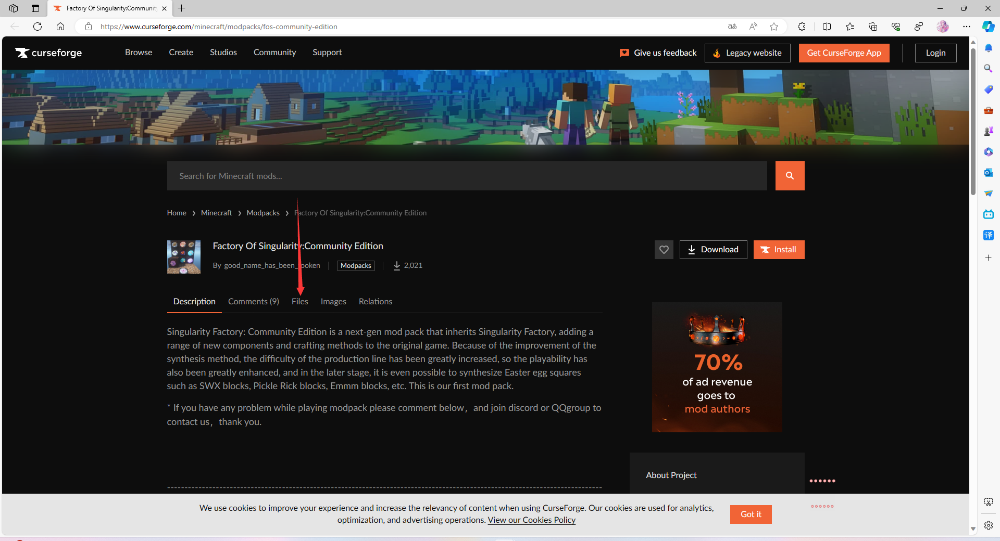
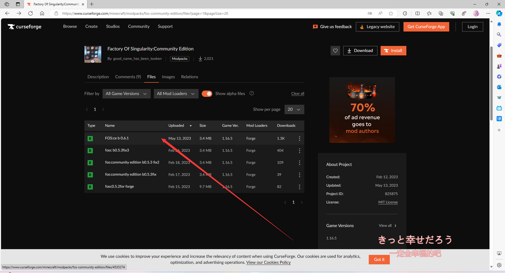
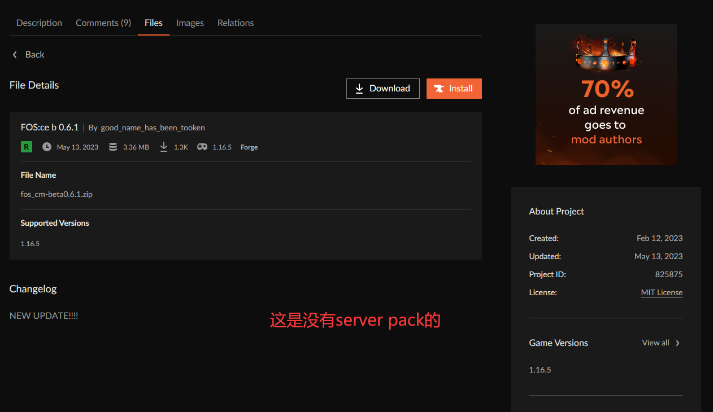
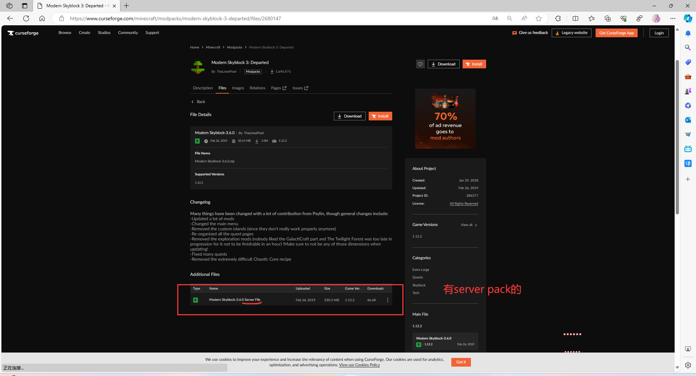
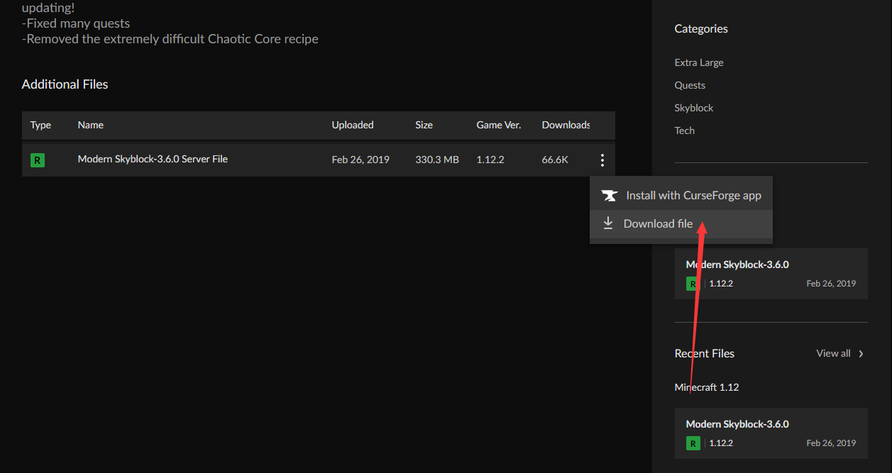
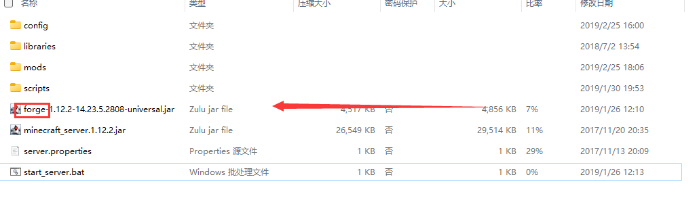
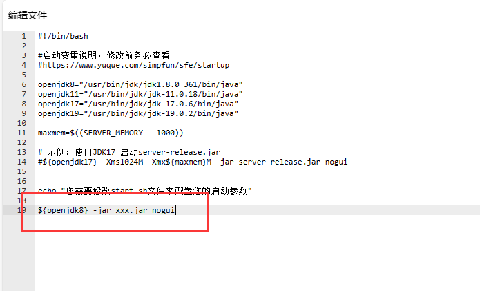

:::warning 写在最前面的警告

+ 如果你打算使用自定义开服的话，请确保你已经具备了一定的开服经验和英文阅读水平。
+ 没有这方面的经验不要轻易尝试这部分的内容！
+ 我们欢迎大家参与完善文档。请到Github[提交issue](https://github.com/ZengXiaoPi/Simpfun_Wiki/issues)或者[发起Pull Requests](https://github.com/ZengXiaoPi/Simpfun_Wiki/pulls)。
:::

:::info

本教程仅针对`curseforge`上的整合包

:::

# 开始

你需要确定你的整合包是否有 `server pack`。
确定方法：

* 打开整合包的curseforge页
* 第2步：
* 第三步：
* 结果：
    
    * 无`server pack`：

    * 有`server pack`：

:::tip

如果你的整合包没有`server pack`的话，~~你可能需要换个整合包？~~

:::

# 正式开始

## 下载`server pack`

来到第三步完成的界面，如下：

下载`server pack`

等待文件下载完成

## 上传到服务器

:::info

你的服务器类型必须是`自定义-需有开服经验 Java镜像`

:::

* 将 "**下载server pack**" 下载下来的zip上传到服务器根目录

* 解压上传的zip

## 启动！
:::info

下面部分需要有一定的`linux bash`经验

:::

### 修改 start.sh

你需要抓住含有`forge` `fabric` ...字眼的`jar`文件，如：

:::warning

`minecraft_server.1.xx.x.jar`一般不能作为启动用的`jar`

:::

修改 start.sh

+ `${openjdk8}` 为使用的java版本，详情见下面tip
+ `xxx.jar` 为你找到有`forge` `fabric` ...字眼的`jar`名（记得带上后缀

:::tip

如果是`1.16.5`或更低版本的整合包，请使用`openjdk8`，
否则使用`openjdk17`

:::

### 修改 `server.properties`

在`server-port`后面添加你实例的端口，例如`server-port=11451`

### 最后，启动！！！！！！
