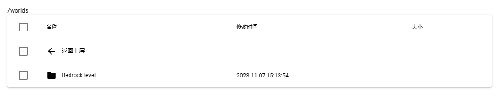
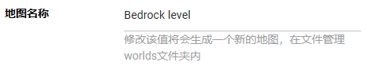
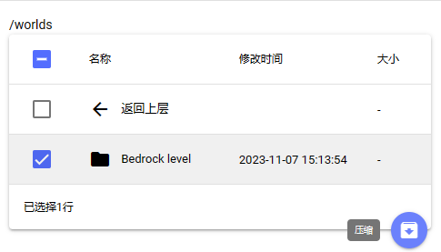
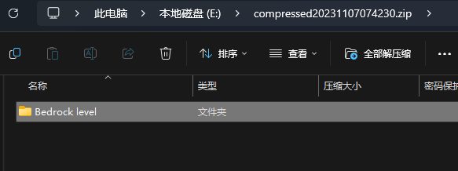
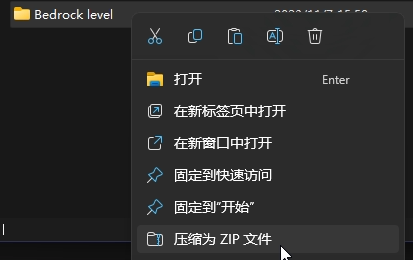
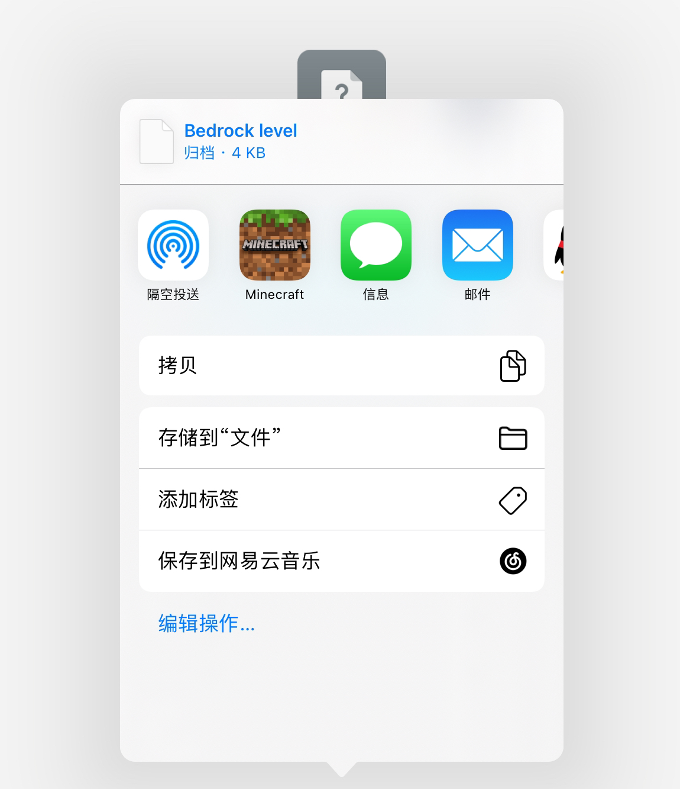
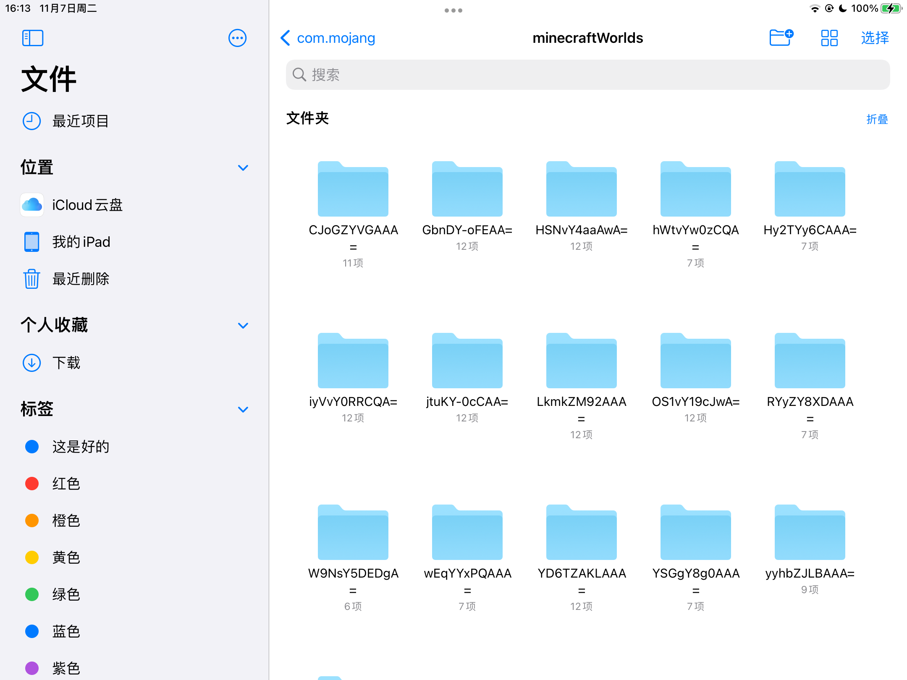

<!--本文件中有引用static/img/pages下的MCBE-Import-Worlds-1.png文件，如果移动此文件则会构建失败-->
<!--早期的苟使文件命名法导致的（我的错）-->
本篇wiki将会介绍如何从服务器下载并往基岩版客户端导入存档。默认使用BDS服务端。

-----

:::tip

**任何**对服务器文件的操作均建议在服务器**关闭**状态下进行！

:::

## 第一步 找到服务器存档

在文件管理中找到文件夹`worlds`后打开，进入目录/worlds，如下图：

在文件夹内找到你的存档。如果没有更改过地图名称，存档名应为`Bedrock Level`（见下图）。

## 第二步 打包并下载存档

选中存档后点击压缩，格式任意。

使用下载将存档下载到本地。

## 第三步 检查存档内文件格式

*在SFE4中，一切涉及对游戏存档的压缩都会被视为“创建备份”而执行消耗30积分的“创建备份”任务，因此我们获取的存档是备份格式，而不是游戏能直接识别的存档格式。*

*下面将介绍正确的存档格式和操作方法。*

打开下载的服务器备份，在里面找到以存档名为名的文件夹（真正的存档）。

打开此文件夹，确保目录`Bedrock Level/`下格式为——正确的存档格式：

| 文件或文件夹 | 说明 |
| :--- | :--- |
| db | 存储存档数据 |
| behavior_packs | 存放行为包 |
| resource_packs | 存放资源包 |
| *texts* | *特殊文本，在存档切换过语言的情况下出现，存放不同语言下不变的文本* |
| levelname.txt | 存放存档名 |
| world_icon.jpeg | 存档图标 |
| level.dat | 存放地图数据 |
| level.dat_old | level.dat的备份 |
| *world_behavior_packs.json* | *记录启用的行为包* |
| *world_behavior_packs_history.json* | *记录所有启用过的行为包* |
| *world_resource_packs.json* | *记录启用的资源包* |
| *world_resource_packs_history.json* | *记录所有启用过的资源包* |

## 第四步 导入存档到游戏客户端

向游戏导入存档有两种方法：将存档打包给游戏识别和直接添加到游戏文件。

### 方法一 将存档打包给游戏识别

此方法在**所有系统**上都适用，所以截图可能来自于不同系统的终端。

将备份文件里的存档目录（如`Bedrock Level`）解压到任意文件夹，然后压缩为.zip格式的压缩包。

将压缩包后缀名**直接更改**为`.mcworld`，然后打开，打开方式选择`Minecraft`。*（如果弹出“打开为：文档/音乐/视频 等”的窗口，选择文档/其他后选择`Minecraft`）*

如果存档格式正确，游戏会自动识别并导入。

### 方法二 直接添加到游戏文件

:::tip

请确保您的游戏开启了“将文件保存到外部存储”，否则以下目录可能不存在！

:::

#### iOS/iPadOS

在“文件”App中打开以下目录：`(我的iPhone/iPad)/Minecraft/games/com.mojang/minecraftWorlds`

将[上一步](#第三步-检查存档内文件格式)中的文件夹`Bedrock Level`直接复制到此文件夹内，打开游戏即可发现存档已经导入。

#### Android

在文件管理(推荐使用第三方文件管理器，例如ES，MT等)内打开以下目录：`Android/data/com.mojang.minecraftpe/files/games/com.mojang/minecraftWorlds/`

将[上一步](#第三步-检查存档内文件格式)中的文件夹`Bedrock Level`直接复制到此文件夹内，打开游戏即可发现存档已经导入。

#### Windows10/11

在文件资源管理器种打开以下目录`C:\Users\（这里是你电脑的用户名）\AppData\Local\Packages\Microsoft.MinecraftUWP_8wekyb3d8bbwe\LocalState\games\com.mojang\minecraftWorlds`

将[上一步](#第三步-检查存档内文件格式)中的文件夹`Bedrock Level`直接复制到此文件夹内，打开游戏即可发现存档已经导入。  
