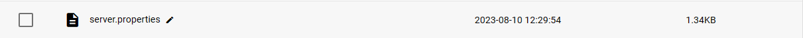

:::info

本文档隶属于[关于server.properties](../20-serverproperties.md)文档。

:::

*注：似乎SFE4中的预设默认关闭正版验证（在线模式）来着*

想和朋友联机但是没有正版？只需在服务器内关闭正版验证即可轻松联机！
  
## 正版和非正版的区别？

||**正版**|**非正版**|
| ---- | ---- | ---- | 
| **皮肤** | 只需在官网设置好，即可使用！ | 需使用其它办法实现皮肤显示，否则为默认皮肤 |
| **服务器连接** | 可以游玩正版服务器，如hyp(由于正版验证API原因，位于国内的正版服务器可能会出现无法连接的问题) | 只能游玩离线服，但由于无需验证服务器验证，连接相对流畅 |  
 
## 修改配置文件来关闭验证

进入服务器文件管理，在根目录打开`server.properties`文件

在文件中找到`online-mode=true`这一行，将`true`改为`false`即可关闭正版验证。
   
:::tip 支持正版！

### 如果条件允许，我们提倡您通过微软商店购买正版！

:::

## 后话（萌新慎入

自从1.20开始游戏内置了皮肤，离线服务器下玩家外观不再只有Steve和Alex两个皮肤，而是各种各样……

但是进入服务器后，你分配到的皮肤大概率会是~~内个~~黑人。

:::warning 以下内容萌新勿入！

如果觉得**默认分配出的皮肤不好看**同时不想买正版，可以阅读此文档来为你的服务器启用**第三方登录**[进阶教程：为服务器启用第三方登录](../50-authlib-injector.md)

再次温馨提示：开服小白请勿选用第三方登录，问问题被骂不管编者事！~~（逃~~

:::