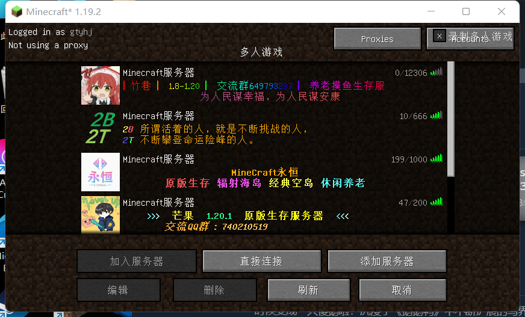

<--玩原神玩的-->

:::info

你可以更改服务器的`motd`设置和图标，从而使服务器在服务器列表里更好看一些。



:::

# 服务器描述

## 更改服务器描述（motd）

也可见于[server.pro文档](20-serverproperties.md#motd服务器在列表里显示的信息)

在`server.properties`文件中，有值`motd`，SFE4中默认为SFE4 SERVER。如下：

```
motd=SFE4 SERVER
```

将motd=后的内容改为自己想要的描述即可。

如果只是单纯更改文字，则描述会显示为灰色。在一些版本里需要转码，见于[server.pro文档](20-serverproperties.md#motd服务器在列表里显示的信息)。

## 使用插件来丰富描述

原版的motd设置中只有灰色，那hypixel和上图里那些**花里胡哨的字体**都是怎么来的？

实际上，有针对motd的插件可以帮助您丰富motd设置。

### MiniMOTD插件

MiniMOTD 是一个基本的 MOTD 插件，兼容 Minecraft 1.8 以上的旧版本（还支持 BungeeCord、Sponge、Velocity和Fabric）。

插件可以增加RGB颜色、添加渐变色等。

你要使用教程？我不会，所以没有。自己看[mcbbs上的使用教程](https://www.mcbbs.net/thread-1075003-1-1.html)去。

### ColorMOTD

与此相似的插件还有ColorMOTD。我不会用，看[教程](https://www.bilibili.com/read/cv9428815/)去。

# 服务器图标

## 为服务器添加好看的图标

很明显，让服务器更好看不仅仅只有抛弃白字，还有自定义图标对吧？

你需要准备一个`.png`后缀的图片文件，分辨率为16x16、32x32或64x64。

将图片命名为`server-icon.png`然后上传到服务器，重启即可应用图标！
