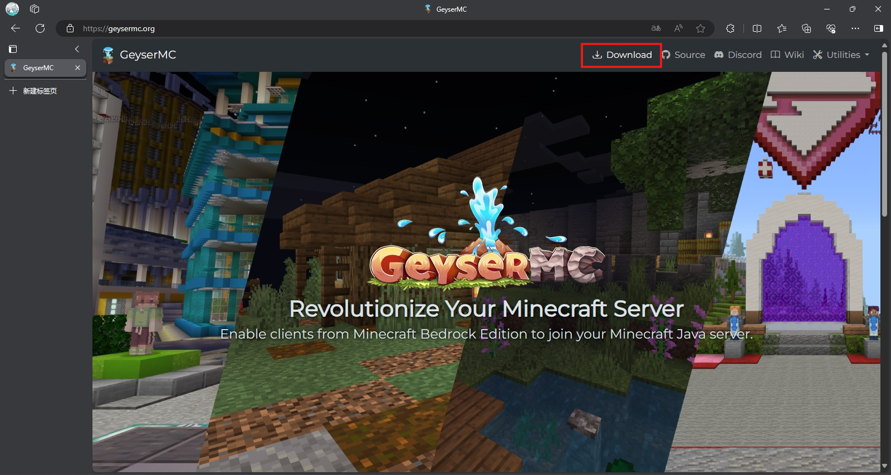
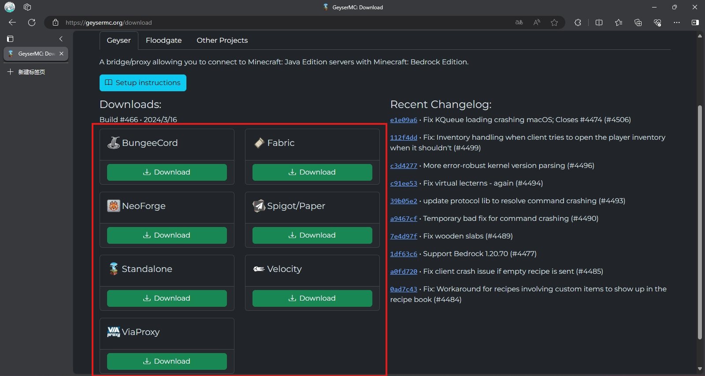

## 首先前往[Geyser主页](https://geysermc.org/)下载Geyser

:::caution 
如果你在国内，期间可能需要一些魔法工具才能流畅访问

当然没有的话你也可以等等...
:::

### 选择你需要的Geyser类型下载

Geyser BungeeCord是给[BungeeCord](https://github.com/SpigotMC/BungeeCord)用的 Geyser 插件

Geyser Fabric是给[Fabric](https://fabricmc.net)Mod加载器使用的 Geyser Mod

Gerser NeoForge是给[NeoForge](https://neoforged.net)Mod加载器使用的 Geyser Mod

Gerser Spigot/Paper是给[Spigot](https://www.spigotmc.org)系列插件加载器使用的 Geyser 插件
:::tip 支持
- Spigot
- Paper
- Purpur
- Leaves

等等,支持spigot插件的服务端....
:::

:::caution Spigot的前身[**bukkit**](https://dev.bukkit.org)已半卒

它似乎已经过气了...
:::

Geyser Standalone是可以独立运行的Gerser程序，也是所谓的独立版Geyser

Geyser Velocity是给[Velocity](https://papermc.io/software/velocity)用的 Geyser 插件

Geyser ViaProxy是给[ViaProxy](https://github.com/ViaVersion/ViaProxy)用的 Geyser 插件

:::caution Geyser

Geyser需要Java 16及以上的Java运行环境

如果您的Minecraft Java服务器的Java版本低于**16**,考虑使用Geyser独立版连接服务器

并且游戏版本需要保持为Geyser所**支持的版本**,如果您的Minecraft Java服务器游戏版本较低,请考虑使用[ViaVersion](../200-goodplugin.md#viaversion-⭐)和[ViaBackwards](../200-goodplugin.md#viabackwards)。

Fabric版本Geyser的需要[**FabricAPI**](https://www.curseforge.com/minecraft/mc-mods/fabric-api/files)才能正常运行。

:::

## 使用方法

插件版本的把Geyser插件丢进plugins文件夹；

Mod版本的丢进Mods文件夹；

独立版的可以直接使用**Java17**及以上Java环境执行。

## Geyser配置

参见[配置Geyser](./3-ConfigGeyser.md)。

配置无较大差异，可能会因为使用场景多样化，配置略微不同。
