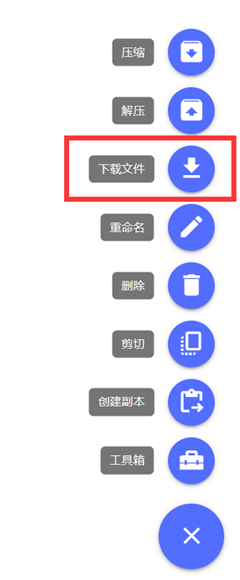

本篇文档将介绍如何从服务端导出存档。

## 从Vanilla/Fabric/Forge/NeoForge服务端导出

按照下图方式将`world`文件夹压缩(此处的`world`为你的服务器的`server.properties`中[`level-name`设置的值](./20-serverproperties.md#level-name存档世界名称))。

等待任务执行完成后，回到`文件`页面，在服务器根目录下找到类似`compressed20240426165745.zip`的压缩文件，如下图所示：

compressed后的数字即代表文件完成压缩时的时间(精确到秒)。

勾选已创建好的压缩文件，点击右下角三个点，选择`下载文件`，简幻欢将尝试让浏览器创建下载任务。

:::caution 提示

如果浏览器无法创建下载任务，请尝试更换浏览器！

推荐的浏览器：

PC端：[Chrome](https://www.google.cn/chrome/)，[Edge](https://www.microsoft.com/zh-cn/edge/download)，[Supermium](https://win32subsystem.live/supermium/)，[FireFox](https://www.firefox.com.cn/)

安卓端(前往手机应用商店即可下载)：[Edge](https://learn.microsoft.com/zh-cn/deployedge/microsoft-edge-install-mobile-china)，[Chrome](https://www.techspot.com/downloads/5818-google-chrome-for-android.html)，[Via(当Android System Webview版本大于100时)](https://viayoo.com/zh-cn/)

:::

如需要导入到客户端，则将解压后的world文件夹移入客户端存档目录即可。

## 从Bukkit系服务端导出

Bukkit系服务端(例如：Spigot、Paper、Purpur等服务端)的世界存储如下所示：

| 服务端类型 | 主世界及其他数据 | 下界数据 | 末地数据 |
| :---- | :---- | :---- | :---- |
| Vanilla | `/world` | `/world/DIM-1` | `/world/DIM1` |
| Bukkit系服务端 | `/world` | `/world_nether/DIM-1` | `/world_the_end/DIM1` |

### 仅备份，不导入到客户端时

直接压缩服务器根目录下的`/world`、`/world_nether`、`/world_the_end`三个文件夹。

此处的`world`为你的服务器的`server.properties`中[`level-name`设置的值](./20-serverproperties.md#level-name存档世界名称)。

等待任务执行完成后，回到`文件`页面，在服务器根目录下找到类似`compressed20240426165745.zip`的压缩文件，如下图所示：

compressed后的数字即代表文件完成压缩时的时间(精确到秒)。

勾选已创建好的压缩文件，点击右下角三个点，选择`下载文件`，简幻欢将尝试让浏览器创建下载任务。

:::caution 提示

如果浏览器无法创建下载任务，请尝试更换浏览器！

推荐的浏览器：

PC端：[Chrome](https://www.google.cn/chrome/)，[Edge](https://www.microsoft.com/zh-cn/edge/download)，[Supermium](https://win32subsystem.live/supermium/)，[FireFox](https://www.firefox.com.cn/)

安卓端(前往手机应用商店即可下载)：[Edge](https://learn.microsoft.com/zh-cn/deployedge/microsoft-edge-install-mobile-china)，[Chrome](https://www.techspot.com/downloads/5818-google-chrome-for-android.html)，[Via(当Android System Webview版本大于100时)](https://viayoo.com/zh-cn/)

:::

### 导入到客户端

按照[上面的方式](#仅备份不导入到客户端时)压缩三个文件夹并下载，下载完成后在本地找一个地方进行解压。

将 `/world_nether/DIM-1` 文件夹复制到 `/world` 文件夹中。  

将 `/world_the_end/DIM1` 文件夹复制到 `/world` 文件夹中。  

删除 `/world_nether` 和 `/world_the_end` 文件夹。  

最终结果应如下图所示：

将更改后的world文件夹移入客户端的存档目录即可。
