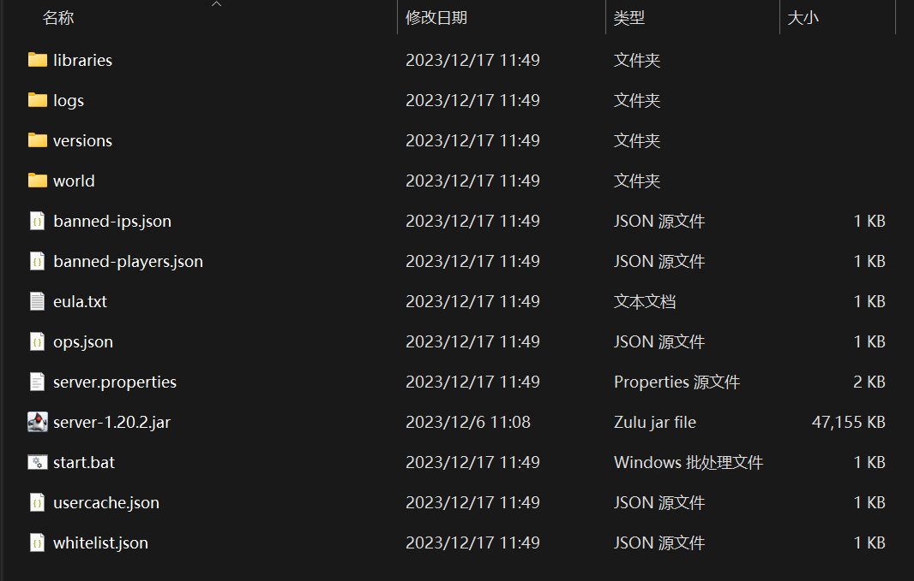
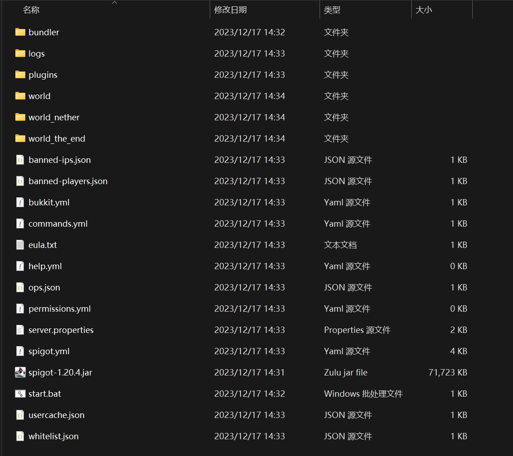
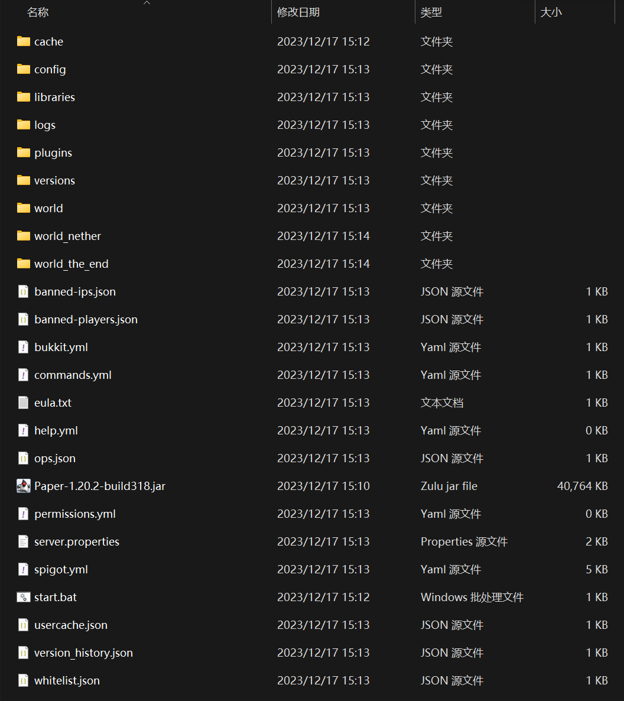
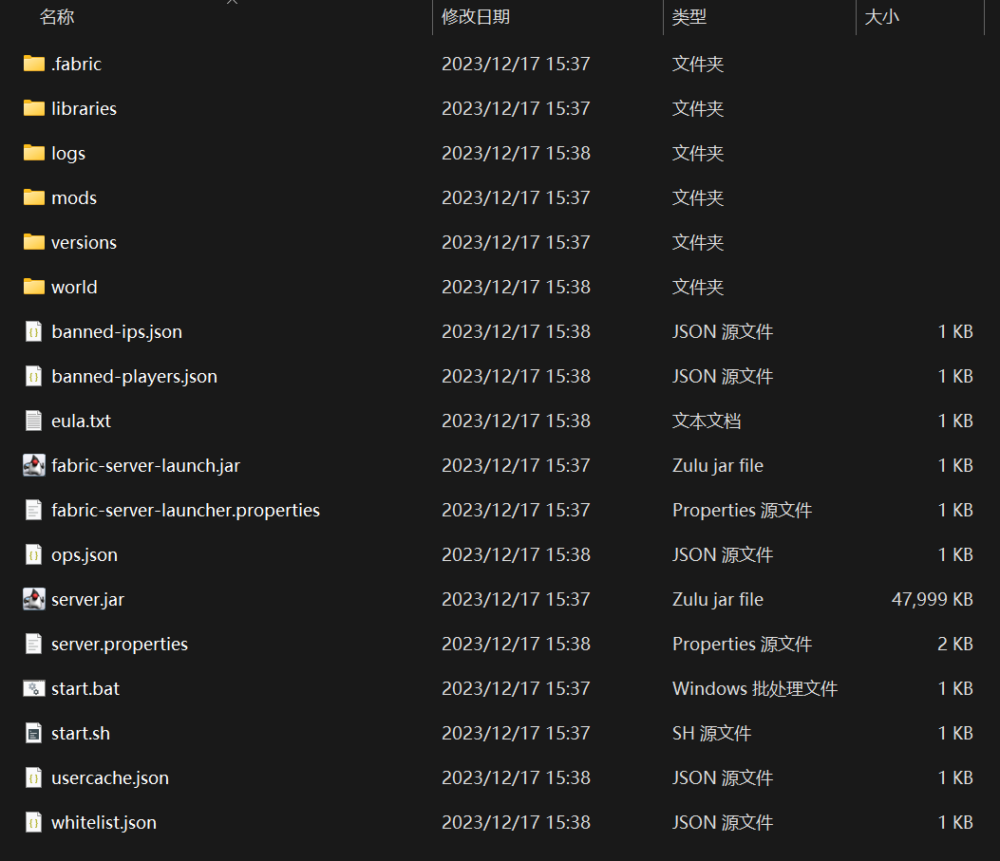
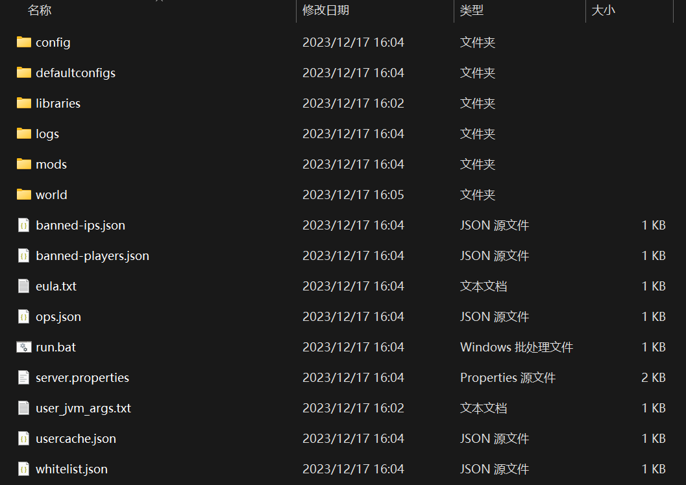
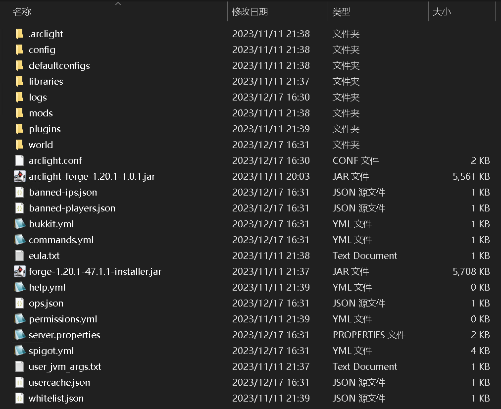
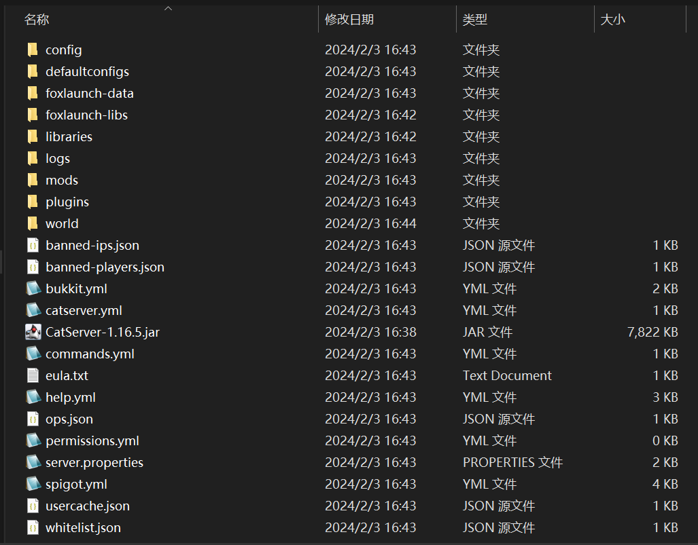

:::tip

此文档为介绍服务端预设的文件结构，即各个文件夹及其说明。

若有不精确或不完备的地方，欢迎指正及补漏。

:::

-----

## Vanilla端

首先，让我们从最基础的Vanilla端开始说起。



*这是Vanilla1.20.2的服务端文件(仅展示根目录下的)。*

| 文件或文件夹 | 说明 |
| :--- | :--- |
| libraries | 存储游戏所需的Java库。如果你不知道里头都是啥不要去动！ |
| logs | 这是服务端的日志文件夹，用于存储服务端的运行日志。 |
| versions | 存储游戏的各个版本。每个版本文件夹中包含了该版本的Minecraft服务端程序及其相应的依赖项。 |
| world | 这是服务端的世界文件夹，用于存储服务端生成和加载的世界数据。<br/>此文件夹名称可以在[server.properties](./20-serverproperties.md)内的`level-name`一项修改 |
| banned-ips.json | 记录被封禁的IP地址。 |
| banned-players.json | 记录被封禁的玩家的UUID（唯一标识符）。 |
| eula.txt | 这是服务端的许可协议文件，用于确认用户同意遵守[Minecraft的最终用户许可协议（EULA）](https://www.minecraft.net/zh-hans/eula)。 |
| ops.json | 记录被授予操作员权限的玩家信息。<br/>`ops.json`中存储的是玩家的UUID，而不是他们的用户名。 |
| server-1.20.2.jar | 这是服务端的主程序，用于启动和运行服务端（核心文件名你可以随便改, 改完记得在启动文件中修改启动参数）。 |
| server.properties | 这是服务端的配置文件，用于设置服务端的各种属性。[有关server.properties的详细解释](./20-serverproperties.md) |
| usercache.json | 用于缓存玩家的UUID（唯一标识符）和用户名的映射关系。这个文件主要用于加速玩家登录过程。<br/>需要注意的是，此文件不会存储玩家的数据。 |
| whitelist.json | 记录被允许连接到服务器的玩家列表。<br/>此文件包含了被允许连接的玩家的UUID和用户名。 |

*碎碎念：关于logs文件夹，它会存储服务器每次运行时的控制台输出并以txt文档保存，命名为服务器启动时间。感觉没必要为这个文件夹单开一个文档，所以在这说了。*

-----

## Bukkit系端

Bukkit系端的各种分支比较多，此处挑两个比较有代表性的服务端来说。

### Spigot端

作为Paper的上游，这个端我认为还是需要拉出来说下的。



*这是Spigot1.20.4的服务端文件(仅展示根目录下的)。*

与Vanilla端不同的地方如下所示（斜体表示不重要）：

| 文件或文件夹 | 说明 |
| :--- | :--- |
| bundler | Spigot端将Vanilla端下的`libraries`和`versions`两个文件夹的东西都合并到了这个文件夹内(勘误: 此处使用的为bundlerJar文件, 并非spigot特有)。 |
| plugins | 存放插件本体以及插件配置、数据等的文件夹。插件本体直接放入此文件夹即可。 |
| world | 在**所有Bukkit系服务端**内，世界存档**被拆成了三个文件夹**。<br/>此文件夹存储的是主世界数据和玩家数据。<br/> 同时，[server.properties](./20-serverproperties.md)内的`level-name`的值会被同时应用在三个世界上面，即同时替换world字符。 |
| world_nether | 存放下界(地狱)数据。 |
| world_the_end | 存放末地数据。 |
| bukkit.yml | Bukkit系服务端的配置文件之一，用于配置一些基本的服务器设置。<br/>所有CraftBukkit的分支都有此配置文件。 |
| *commands.yml* | 一个配置文件，其中包含 CraftBukkit 服务器的自定义别名和命令方块覆盖。<br/>命令方块覆盖系统提供了一种快速简便的方法，可以强制服务器将Mojang提供的命令（而不是Bukkit中内置的命令）用于命令方块，而所有其他命令保持不变。<br/>而别名系统本质上使高级用户服务器管理员能够定义自定义命令并强制将特定版本的命令用于默认命令。<br/> *PS：正常情况下你大概率用不到，甚至这东西都是去[互联网档案馆](https://web.archive.org/web/20160325102040/http://wiki.bukkit.org/Commands.yml)查的资料。* |
| *help.yml* | 这是Bukkit的帮助配置文件。<br/>默认情况下，您不需要修改此文件。所有插件命令的帮助主题由插件自动提供。<br/>*PS：正常情况下你大概率也用不到，因为现在的插件都会提供对应的帮助。*|
| *permissions.yml* | 用于定义玩家和用户组的权限。这个文件通常用于配置LuckPerms插件的权限设置。<br/>*PS：花瓶一样的东西，当个摆设就好(如果你有LP的话)。*|
| spigot.yml | Spigot服务端软件的配置文件之一，用于配置一些与服务器性能和行为相关的设置。<br/>从Spigot分支出的服务端均有此文件。 |

### Paper端

现在很多服务端都是从Paper端分支出来的，因此这个是必须要说说的。



*这是Paper1.20.2的服务端文件(仅展示根目录下的)。*

与Vanilla端不同的地方如下所示（斜体表示不重要）：

| 文件或文件夹 | 说明 |
| :--- | :--- |
| cache | 存放原版服务端核心。<br/>从Paper分支出的服务端均有此文件夹(勘误: bundlerJar为bundler文件夹)。 |
| config | 存放Paper端特有的配置文件。<br/>从Paper分支出的服务端均有此文件夹。 |
| plugins | 存放插件本体以及插件配置、数据等的文件夹。插件本体直接放入此文件夹即可。 |
| world | 在**所有Bukkit系服务端**内，世界存档**被拆成了三个文件夹**。<br/>此文件夹存储的是主世界数据和玩家数据。<br/> 同时，[server.properties](./20-serverproperties.md)内的`level-name`的值会被同时应用在三个世界上面，即同时替换world字符。 |
| world_nether | 存放下界(地狱)数据。 |
| world_the_end | 存放末地数据。 |
| bukkit.yml | Bukkit系服务端的配置文件之一，用于配置一些基本的服务器设置。<br/>所有CraftBukkit的分支都有此配置文件。 |
| *commands.yml* | 一个配置文件，其中包含 CraftBukkit 服务器的自定义别名和命令方块覆盖。<br/>命令方块覆盖系统提供了一种快速简便的方法，可以强制服务器将Mojang提供的命令（而不是Bukkit中内置的命令）用于命令方块，而所有其他命令保持不变。<br/>而别名系统本质上使高级用户服务器管理员能够定义自定义命令并强制将特定版本的命令用于默认命令。<br/> *PS：正常情况下你大概率用不到，甚至这东西都是去[互联网档案馆](https://web.archive.org/web/20160325102040/http://wiki.bukkit.org/Commands.yml)查的资料。* |
| *help.yml* | 这是Bukkit的帮助配置文件。<br/>默认情况下，您不需要修改此文件。所有插件命令的帮助主题由插件自动提供。<br/>*PS：正常情况下你大概率也用不到，因为现在的插件都会提供对应的帮助。*|
| *permissions.yml* | 用于定义玩家和用户组的权限。<br/>*PS：你要是用LP插件的话这个文件无关紧要,LP默认数据存储在H2数据库中(新的花瓶,好耶!)。*|
| spigot.yml | Spigot系服务端软件的配置文件之一，用于配置一些与服务器性能和行为相关的设置。<br/>从Spigot分支出的服务端均有此文件。 |
| *version_history.json* | 记录此服务器使用的服务端的历史版本。<br/>从Paper分支出的服务端均有此文件。 |

-----

## Mod 端

### Fabric端



*这是1.20.4 - Fabric 0.15.2的服务端文件(仅展示根目录下的)。*

与Vanilla端不同的地方如下所示（斜体表示不重要）：

| 文件或文件夹 | 说明 |
| :--- | :--- |
| .fabric | 通常包含有关mod和开发环境的配置信息，用于存储一些与Fabric模组和开发环境相关的设置。 |
| mods | 存放mod本体的文件夹。 |
| worlds | **与Vanilla端保持一致。** |
| fabric-server-launch.jar | 用于启动Fabric服务端。 |
| fabric-server-launcher.properties | Fabric端的设置文件。但里面只有一个`serverJar`用来设定游戏核心文件名。 |
| server.jar | 原版服务端核心。<br/>如果你改了此文件的名称，那么`fabric-server-launcher.properties`内的`serverJar`你也得改！<br/>PS：**不要尝试从此文件启动服务端，不然会不加载mod！** |

### Forge端

此部分仅介绍1.17.1+版本的Forge服务端。



*这是1.20.1 - Forge 47.1.43的服务端文件(仅展示根目录下的)。*

与Vanilla端不同的地方如下所示（斜体表示不重要）：

| 文件或文件夹 | 说明 |
| :--- | :--- |
| config | 存储FML和各个模组(mod)的配置文件的目录。|
| defaultconfigs | 通常包含了模组(mod)的默认配置文件。这些文件是模组作者提供的初始配置，用于确保模组在首次安装时有一个合理的默认设置。 |
| mods | 存放mod本体的文件夹。 |
| worlds | **与Vanilla端保持一致。** |
| *user_jvm_args.txt* | Forge服务端构建时生成的一个完全没有用的文件。 |

需要注意的是，1.17.1+版本的Forge服务端你在根目录下是找不到Forge核心与原版核心的。其启动命令应如下所示：

Linux：

```sh
${openjdk17} -server -Xms1024m -Xmx4096M @libraries/net/minecraftforge/forge/1.20.1-47.1.43/unix_args.txt "$@" -nogui
```

Windows：

```bat
java -server -Xms1024m -Xmx4096M @libraries/net/minecraftforge/forge/1.20.1-47.1.43/win_args.txt %* -nogui
```

### NeoForge

与1.17.1+版本的Forge服务端一致，在根目录下是找不到NeoForge核心与原版核心的。由于更改了项目名称，其启动命令应如下所示：

Linux：

```sh
${openjdk17} -server -Xms1024m -Xmx4096M @libraries/net/neoforged/neoforge/20.2.86/win_args.txt "$@" -nogui
```

Windows：

```bat
java -server -Xms1024m -Xmx4096M @libraries/net/neoforged/neoforge/20.2.86/win_args.txt %* -nogui
```

## 混合端

众所周知，混合端个个都是~~奇葩~~。

### Arclight



*这是Arclight 1.20.1的服务端文件(仅展示根目录下的)。*

与Vanilla端不同的地方如下所示（斜体表示不重要）：

| 文件或文件夹 | 说明 |
| :--- | :--- |
| .arclight | 存放Arclight端部分重要文件。 |
| config | (来自Forge)存储FML和各个模组(mod)的配置文件的目录。|
| defaultconfigs | (来自Forge)通常包含了模组(mod)的默认配置文件。这些文件是模组作者提供的初始配置，用于确保模组在首次安装时有一个合理的默认设置。 |
| mods | (来自Forge)存放mod本体的文件夹。 |
| plugins | (来自Spigot)存放插件本体以及插件配置、数据等的文件夹。插件本体直接放入此文件夹即可。 |
| worlds | **与Vanilla端保持一致。** |
| arclight.conf | Arclight端的配置文件。 |
| arclight-forge-1.20.1-1.0.1.jar | Arclight端的构建器与启动文件，需要使用此文件启动Arclight服务端。 |
| bukkit.yml | (来自Spigot)Bukkit系服务端的配置文件之一，用于配置一些基本的服务器设置。<br/>所有CraftBukkit的分支都有此配置文件。 |
| *commands.yml* | (来自Spigot)一个配置文件，其中包含 CraftBukkit 服务器的自定义别名和命令方块覆盖。<br/> *PS：正常情况下你大概率用不到，甚至这东西都是去[互联网档案馆](https://web.archive.org/web/20160325102040/http://wiki.bukkit.org/Commands.yml)查的资料。* |
| forge-1.20.1-47.1.1-installer.jar | Forge安装器，在Arclight端内不能删！ |
| *help.yml* | (来自Spigot)这是Bukkit的帮助配置文件。<br/>默认情况下，您不需要修改此文件。所有插件命令的帮助主题由插件自动提供。<br/>*PS：正常情况下你大概率也用不到，因为现在的插件都会提供对应的帮助。*|
| *permissions.yml* | (来自Spigot)用于定义玩家和用户组的权限。<br/>*PS：还是个花瓶，有LP的当个摆设就好。*|
| spigot.yml | (来自Spigot)Spigot系服务端软件的配置文件之一，用于配置一些与服务器性能和行为相关的设置。<br/>从Spigot分支出的服务端均有此文件。 |
| *user_jvm_args.txt* | (来自Forge)Forge服务端构建时生成的一个完全没有用的文件。 <br/>仅在1.17.1+的Arclight端上才会出现。 |

### CatServer



*这是CatServer1.16.5的服务端文件(仅展示根目录下的)。*

与Vanilla端不同的地方如下所示（斜体表示不重要）：

| 文件或文件夹 | 说明 |
| :--- | :--- |
| config | (来自Forge)存储FML和各个模组(mod)的配置文件的目录。|
| defaultconfigs | (来自Forge)通常包含了模组(mod)的默认配置文件。这些文件是模组作者提供的初始配置，用于确保模组在首次安装时有一个合理的默认设置。 |
| foxlaunch-data | 存放了包括原版服务端核心在内的一些重要文件。 |
| foxlaunch-libs | 不知道 |
| mods | (来自Forge)存放mod本体的文件夹。 |
| plugins | (来自Spigot)存放插件本体以及插件配置、数据等的文件夹。插件本体直接放入此文件夹即可。 |
| worlds | **与Vanilla端保持一致。** |
| catserver.yml | CatServer端的配置文件。 |
| catserver-1.16.5.jar | CatServer端的构建器与启动文件，需要使用此文件启动CatServer服务端。 |
| bukkit.yml | (来自Spigot)Bukkit系服务端的配置文件之一，用于配置一些基本的服务器设置。<br/>所有CraftBukkit的分支都有此配置文件。 |
| *commands.yml* | (来自Spigot)一个配置文件，其中包含 CraftBukkit 服务器的自定义别名和命令方块覆盖。<br/> *PS：正常情况下你大概率用不到，甚至这东西都是去[互联网档案馆](https://web.archive.org/web/20160325102040/http://wiki.bukkit.org/Commands.yml)查的资料。* |
| *help.yml* | (来自Spigot)这是Bukkit的帮助配置文件。<br/>默认情况下，您不需要修改此文件。所有插件命令的帮助主题由插件自动提供。<br/>*PS：正常情况下你大概率也用不到，因为现在的插件都会提供对应的帮助。*|
| *permissions.yml* | (来自Spigot)用于定义玩家和用户组的权限。<br/>*PS：还是个花瓶，有LP的当个摆设就好。*|
| spigot.yml | (来自Spigot)Spigot系服务端软件的配置文件之一，用于配置一些与服务器性能和行为相关的设置。<br/>从Spigot分支出的服务端均有此文件。 |

### Mohist

待补充

## 如何在不同类型的服务端间互转存档

请参见[Leaves文档 / 迁移到 Leaves 或从 Leaves 迁出](https://docs.leavesmc.top/zh/leaves/migration)。
