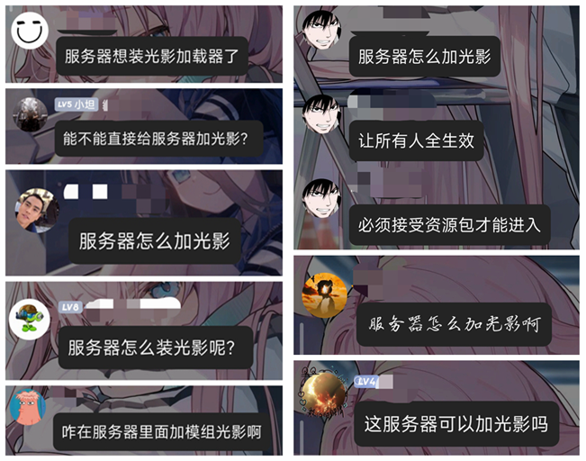
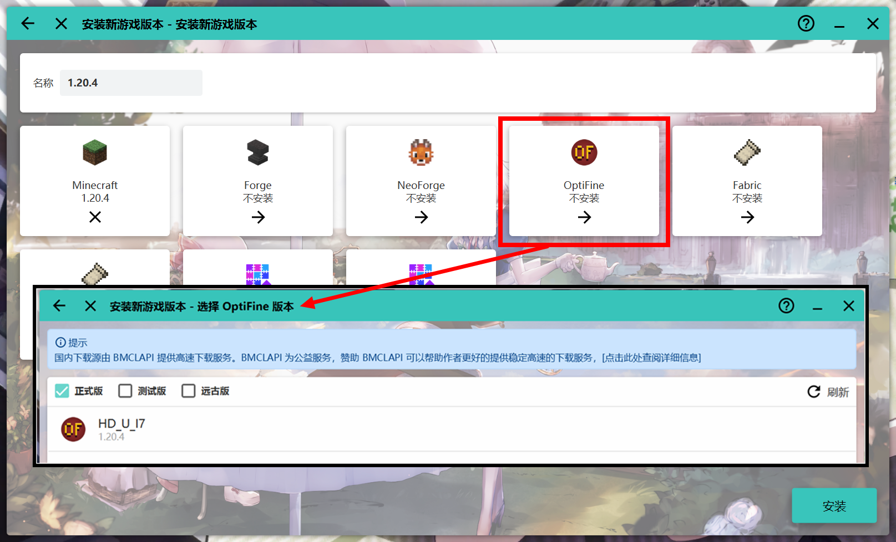
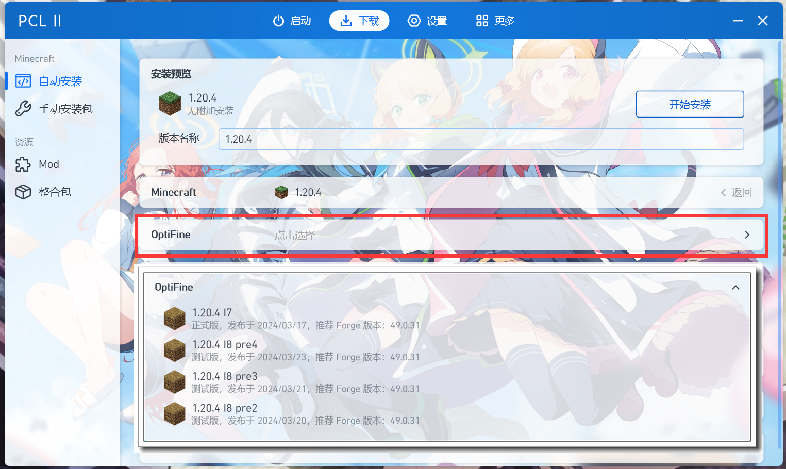
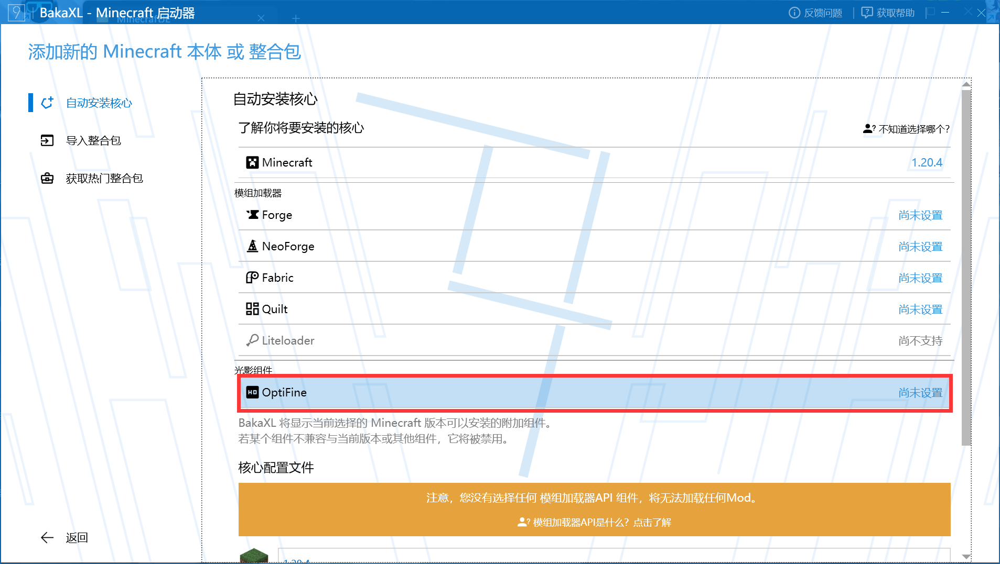
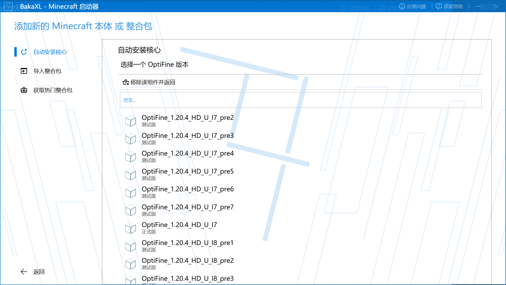
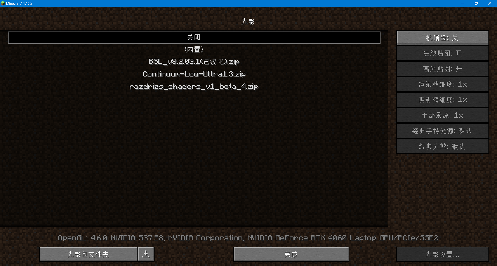
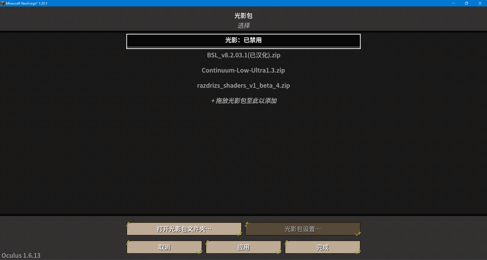
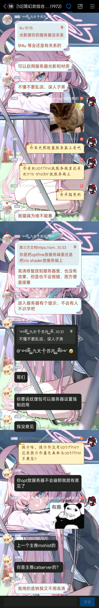
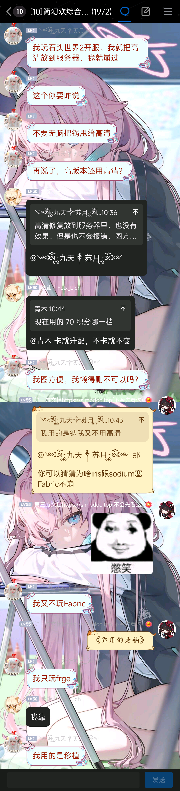
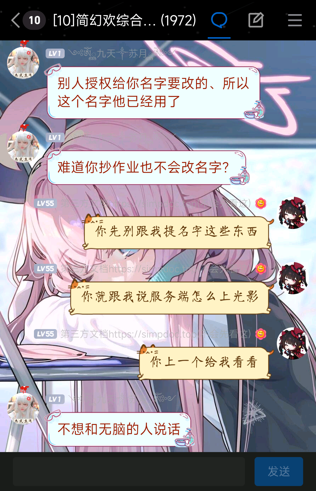

本篇文档将教你如何**正确的**加光影。

## 给服务器装光影

*摘自简幻欢交流群的部分聊天记录*  
*如果你也想被核善的群友~~拷打~~，欢迎加入简幻欢 **1** 群或 **10** 群和群友一起 友 善 交 流 。*

:::warning 记住

服务器是不能加光影的！**光影只能在客户端装载！**

与资源包不同，光影需要mod才能加载，因此**服务器无法强制让客户端启用光影**！

:::

## 给客户端装光影

在以下三种方案中选择一种：

- [给服务器装光影](#给服务器装光影)
- [给客户端装光影](#给客户端装光影)
  - [使用OptiFine](#使用optifine)
  - [使用Sodium + Iris Shaders(Fabric)](#使用sodium--iris-shadersfabric)
  - [使用Embeddium + Oculus(Forge)](#使用embeddium--oculusforge)
- [其他信息](#其他信息)

### 使用OptiFine

:::caution

**Forge**

- 由于兼容性问题，不推荐在1.17.1或更高版本的 Forge 版中使用高清修复！

- 在高版本中，建议使用 [Embeddium + Oculus](#使用embeddium--oculusforge) 来加载光影！

**Fabric**

- 不推荐在Fabric下使用OptiFine，如果你非要用，那么你需要使用[OptiFabric](https://www.mcmod.cn/class/1703.html)作为前置！

- 推荐使用 [Sodium + Iris Shaders](#使用sodium--iris-shadersfabric) 来加载光影！

:::

国内御三家启动器([HMCL](https://hmcl.huangyuhui.net/)，[PCL2](https://afdian.net/a/LTCat)，[BakaXL](https://www.bakaxl.com/))均支持一键安装OptiFine。

**HMCL:**

**PCL 2:**

**BakaXL:**

安装完成后启动游戏。

点击`选项`——`视频设置...`——`光影...`，打开光影设置界面。

默认情况下，除了一个`(内置)`外，OptiFine是不自带光影的。

点击左下角的`打开包文件夹`，将你的光影包复制到这个目录。回到游戏后，OptiFine会自动显示能读取到的光影包，选择一个启用即可。

### 使用Sodium + Iris Shaders(Fabric)

:::info 什么是Sodium

Sodium 是适用于 Minecraft 1.16+ 客户端的免费的强大渲染引擎暨优化模组，它在修复一些图形问题的同时大大提高了渲染性能。与其他以渲染为重点的模组相比，它与 Fabric 的模组生态系统具有广泛的兼容性，且不会影响游戏的画面，让你体验到原汁原味的方块游戏。

*[(摘自MC百科的Sodium页面)](https://www.mcmod.cn/class/2785.html)*

:::

:::info 什么是Iris Shaders

Iris Shaders 是一个旨在与现有的 ShadersModCore / 高清修复 光影兼容的 Fabric 渲染模组。  
Iris Shaders 使用 Mixin，致力于兼容来自 ShadersModCore / 高清修复 的光影，是 Fabric 下 OptiFabric + Optifine 光影解决方案的有效替代品。  

*[(摘自MC百科的Iris Shaders页面)](https://www.mcmod.cn/class/3697.html)*

:::

1. 前往 [CurseForge](https://www.curseforge.com/minecraft/mc-mods/sodium) 或 [Modrinth](https://www.modrinth.com/mod/sodium) 下载对应版本的 Sodium 。
2. 前往 [CurseForge](https://www.curseforge.com/minecraft/mc-mods/irisshaders) 或 [Modrinth](https://modrinth.com/mod/irisshaders) 下载对应版本的 Iris Shaders 。
3. 推荐安装 [Reese的钠视频界面（RSO）](https://www.mcmod.cn/class/4905.html) 改善体验。
4. 将下载好的2个(不安装RSO) / 3个(安装RSO)文件移入`mods`文件夹。
5. 启动游戏。
6. 点击`选项`——`视频设置...`——`光影包`，或者在游戏内按下快捷键(默认为`O`键)打开光影设置界面。

默认情况下，Iris 是不自带光影的。

7. 点击左下角的`打开光影包文件夹`，将你的光影包复制到这个目录。回到游戏后，Iris会自动显示能读取到的光影包，选择一个启用即可。

### 使用Embeddium + Oculus(Forge)

:::info 什么是Embeddium

Embeddium 是 钠 (Sodium) 的非官方分支，基于 铷 (Rubidium) ，但有着额外的更改和错误修复，以更好地融入 Forge 的模组生态。

[*(摘自MC百科的Embeddium页面)*](https://www.mcmod.cn/class/12028.html)

:::

:::info 什么是Oculus

这是一个 Iris 的非官方 Forge 移植版，你可以叫它 Oculus 。

Oculus 与 铷 (Rubidium) 或 Embeddium 等优化 Mod 搭配时，可以充分利用你的显卡。

[*(摘自MC百科的Oculus页面)*](https://www.mcmod.cn/class/5741.html)

:::

1. 前往 [CurseForge](https://www.curseforge.com/minecraft/mc-mods/embeddium) 或 [Modrinth](https://www.modrinth.com/mod/embeddium) 下载对应版本的 Embeddium 。
2. 前往 [CurseForge](https://www.curseforge.com/minecraft/mc-mods/oculus) 或 [Modrinth](https://modrinth.com/mod/oculus) 下载对应版本的 Oculus 。
3. 推荐安装 [TexTrue的Embeddium视频界面（TEO）](https://www.mcmod.cn/class/12057.html) 改善体验。
4. 将下载好的2个(不安装TEO) / 3个(安装TEO)文件移入`mods`文件夹。
5. 启动游戏。
6. 点击`选项`——`视频设置...`——`光影包`，或者在游戏内按下快捷键(默认为`O`键)打开光影设置界面。

默认情况下，Oculus 是不自带光影的。

7. 点击左下角的`打开光影包文件夹`，将你的光影包复制到这个目录。回到游戏后，Iris会自动显示能读取到的光影包，选择一个启用即可。

## 其他信息

  

服务器加光影的反面典型教材
  

奇异搞笑的，到底是谁在误人子弟？

说半天说不过我留下一句"不想和无脑的人说话"然后光速退群，笑了，到底是谁无脑？你要是说的道理还能自己退群？

既然如此，那我就得把你挂出来当个反面典型咯。

